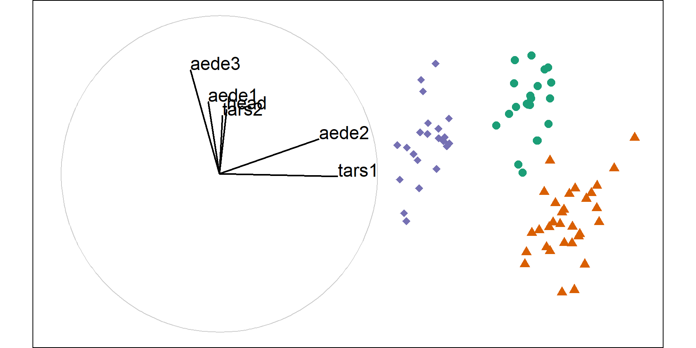
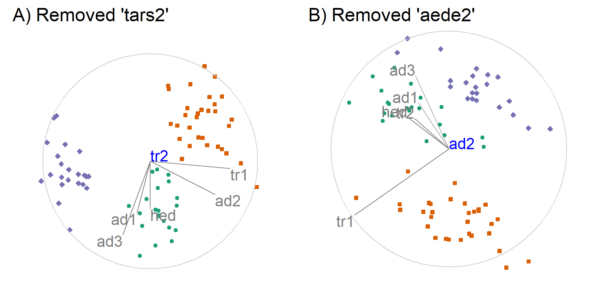
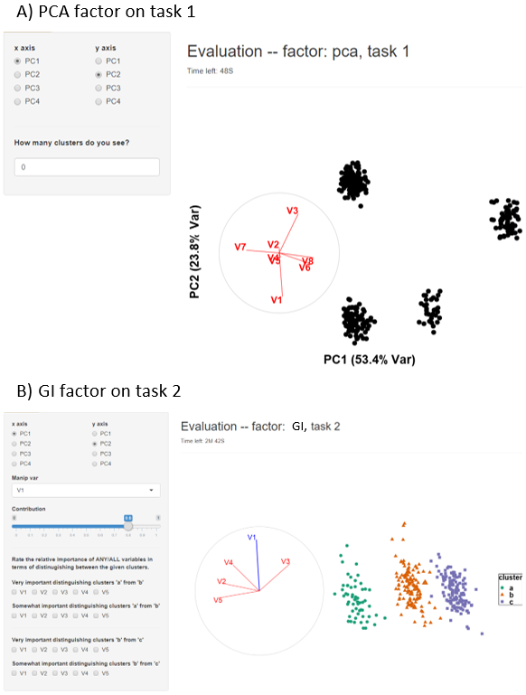
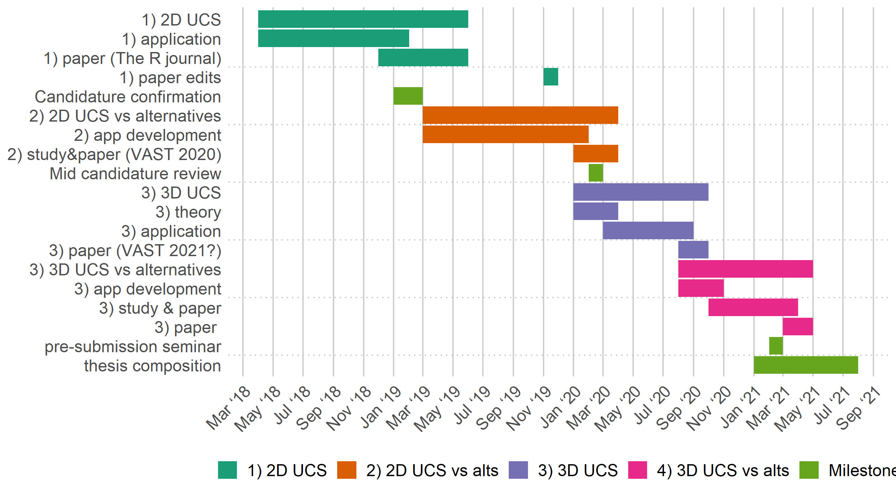

```{r include=FALSE, cache=FALSE}
### For appendix, use `staplR`. 
# Appendix A: spinifex paper
# Appendix B: spinifex experiment paper
if (F){
  library('staplr')
  staple_pdf(input_directory = file.path("."), 
             output_filepath = file.path("./figures/Full_pdf.pdf"))
}

### Keep it simple! No R code in .rmd, use a seprate .r script if need be.
library(knitr) 
knitr::opts_chunk$set(fig.align = "center",
                      echo = F,
                      fig.pos = "h", 
                      # fig.pos="h" # "h"olds the figure postion reltive to local content
                      out.extra = ''
                      #message = FALSE,
                      #warning = FALSE,
                      #error = FALSE,
                      #collapse = TRUE,
                      #comment = "",
                      #cache = F, 
                      #cache.lazy = FALSE
                      
)

# <!-- # cheatsheet {#sec:cheatsheet}-->
# <!-- A bib reference [@wickham_visualizing_2015].  -->
# <!-- A [Section intro](#sec:cheatsheet) reference, alternatively, section \ref{sec:intro} (with no @; \\ref{sec:intro}). -->
# <!-- ```{r crest, echo=FALSE, out.height = "10%", out.width = "10%", fig.cap = "A caption for crest figure"} -->
# <!-- knitr::include_graphics("figures/can_con/crest.jpg") -->
# <!-- ``` -->
# <!-- A figure \@ref(fig:crest) reference (with @; \\@ref(fig:crest). -->
# ref:myFig-cap) Seprate fig cap
# ```{r step2, echo=F, fig.cap = "(ref:myFig-cap)"}
# # <!-- knitr::include_graphics("figures/can_con/crest.jpg") -->
# ```

```

<!-- Report length: 3,000 -  5,000 words ("6 - 10 pgs" of words) -->
<!-- Proposed report  structure: -->
<!-- # Introduction – Summary of the Research Project: -->
<!-- ## Motivation/current state of the field and an identification of a gap in knowledge -->
<!-- ## Research Objective -->
<!-- ## Methodology/method/data-collection & analysis -->
<!-- # Progress since confirmation -->
<!-- # Proposed Thesis Structure – including a table of the writing  status -->
<!-- # Publications arising from the thesis – published or planned -->
<!-- # Potential issues for the panel to consider -->
<!-- ## Resources/funding requests -->
<!-- ## Absence of student/supervisor -->
<!-- ## Other issues. -->


<!-- An abstract summarizes, usually in one paragraph of 300 words or less, the major aspects of the entire paper in a prescribed sequence that includes: 1) the overall purpose of the study and the research problem(s) you investigated; 2) the basic design of the study; 3) major findings or trends found as a result of your analysis; and, 4) a summary of your interpretations and conclusions. -->


# Introduction {#sec:intro}

## Motivation 
<!-- objectively, why research is important -->

<!-- Visuals are important for EDA -->
The term exploratory data analysis (EDA) was coined by @tukey_exploratory_1977, who leaves it as an intentionally broad term that encompasses the initial summarization and visualization of a data set. This is a critical first step of checking for realistic values and validating model assumptions. It may be tempting to review a series of summary statistics to check model assumptions. However, there are known datasets where the same summary statistics miss glaringly obvious visual patterns [@anscombe_graphs_1973; @matejka_same_2017]. It is strikingly simple to look at the wrong, or incomplete set of statistics needed to validate assumptions. Data visualization is fast, versatile, and robust relative to the alternative of numeric statistical summarization. Data visualization does and must remain a primary component of data analysis and model validation.

<!-- high-dimensional challenge -->
Data and models are typically **high-dimensional**, with many variables, and possibly many model parameters. Conventionally, $n$ is used for the number of sample observations, and $p$ is used for the number of variables. Developing new methods to visualize high dimensions has been a pursuit of statisticians, computer scientists and visualization researchers for decades. While automated analysis is the norm, there remains some benefit of user interaction to help the analyst understand results, and determine the importance of components in a model. An interplay between automated and human control is useful. As technology changes, new approaches to user interaction emerge, and exploring these technologies provides a challenge to researchers.

<!-- Adding plotting dimensions -->
Linear projections are commonly used to reduce the dimensionality. A **linear projection** is the linear transformation of the $p$-dimensional space into a low-($d-$)dimensional space, by matrix multiplication of the data with an orthonormal $p\times d$ basis. An orthonormal basis has columns that are orthogonal to each other and of length 1. 

<!-- what do we learn from a linear projection -->
Good linear projections are often found with an automated procedure, like principal component analysis [PCA; @pearson_liii._1901] or projection pursuit (@kruskal_toward_1969). These reduce the dimensionality and reveal something interesting about the data. Figure \@ref(fig:basis) shows a $d = 2$ -dimensional projection of $6D$ data, revealing clustering of labelled groups. The basis that produced this projection is:

\begin{equation*}
\left[ \begin{array}{rr}
  0.70 & -0.50 \\
 -0.27 & -0.52 \\
  0.28 & -0.14 \\
  0.26 &  0.63 \\
  0.08 & -0.16 \\
  0.54 &  0.18 \\
\end{array} \right]
\end{equation*}

```{r basis, echo = FALSE, out.width = "100%",                               fig.cap = "Axes vectors of the basis and resulting projection of the data. Data is assigned color and shape by cluster."}

```

Figure \@ref(fig:basisStructure) shows how the **sensitivity of structure** in a projection can depend on variables contributing to the projection. When variable 'tr1' is rotated out, there is a change to the structure, clusters are less visible. This says that the structure *is sensitive* to variable 'tr1'. When variable 'tr2' is rotated out, there is no change to the structure, clusters are still visible. This says that the structure *is NOT sensitive* to variable 'tr2'.

```{r basisStructure, echo = FALSE, out.width = "100%",                             fig.cap = "Illustration of sensitivity of cluster structure in the projection as a function of variable contributions. In pane A) the variable 'tr1' is removed and cluster in purple dimonds in no longer separated; 'tr1' is a sensitive to cluster structure. In pane B) 'tr2' is removed and cluster are still distinguished. the variable 'tr' is not sensitive to clustering."}

```

Exploring the sensitivity of structure in a projection to the contributions of particular variables requires **geodesic interpolation** to remove the variable from (or into) the projection plane. Geodesic interpolation is effectively a rotation, it maintains orthonormality of all new data projections and any intermediate projections. Geodesic interpolation is used in tour methods [cook_grand_2008; @asimov_grand_1994], including the **grand tour** which shows (automated) movies of low-dimensional projections of high-dimensional spaces. The `tourr` package [@wickham_tourr:_2011] in R provides a range of automated tours. 

Sensitivity analysis is ideally achieved with user-controlled steering where the human controls the rotation of a variable into and out of a projection. This will enable various intermediate states to be shown to better understand the effect of single variables. 


## Research objectives

The overall question of interest is:

**Can geodesic interpolator with user interaction help analysts understand linear projections of data, and explore the sensitivity of structure in the projection to the variables contributing to the projection?**

Which is divided into these more focused objectives:

1. **How do we define user interaction for a geodesic interpolator to add and remove variables smoothly from a 2D linear projection of data?**\
@cook_manual_1997 described an algorithm for manually controlling a tour ($p$-D into 2D), to rotate a variable into and out of a 2D projection. This algorithm provides the start to a human-controlled geodesic interpolator (GI). It must be adapted so that the user has more control of the interpolation. The user will be able to set the range of motion from full $[-1~to~1]$, to allow the user to intercept the rotation at any step, and to output to a device that allows the user to reproduce motions and animate or rock the rotation backward and forwards. These fine-tuned controls will provide a better tool for sensitivity analysis.

2. **Do analysts understand the relationship between variables and structure in a 2D linear projection better when the geodesic interpolator is available?**\
Current practice for high-dimensional data is to make a single low-dimensional representation, with a method such as principal component analysis. Often just the first two principal components are shown, which is equivalent to a 2D projection. This technique is also called a biplot[@gabriel_biplot_1971]. Another more rarely used technique is a tour, which shows an animation of 2D projections. It can be used to get an overview of the structure in the multivariate space, but it is difficult to assess the importance of variables to a particularly interesting low-dimensional structure. 

3. **Can we define a geodesic interpolator for 3D projections, so that the technology can be implemented in modern virtual reality environments?**\
The cutting edge of visualization research today is in virtual reality (VR) environments, as technology has advanced to make this accessible to the masses. It is interesting to explore how analysis with 3D graphics operates in comparison with 2D graphics. The existing algorithms should be extended to 3D projections. 

4. **Does 3D provide advantages over 2D for understanding structure in high-dimensional data when exploring projections from a geodesic interpolator?**\
@gracia_new_2016 compares analyst tasks between 2D scatterplots on a tradition monitor and 3D scatterplots in VR. They find modest accuracy and error improvements for distance perception and outlier identification in favor of 3D at the cost of a relatively small increase in task time. @nelson_xgobi_1998 similarly compares a 2D projection on a traditional monitor and its 3D  manipulation space in a VR. They find a slight advantage in the sphere test and a large advantage in the cluster test in favor of the 3D manipulation space in VR. Research should be done to see if analogous results hold for 3D projections using interactive GI.


## Methodology

The research corresponding with RO #1 entails _algorithm design_ adapting the algorithm from @cook_manual_1997. This allows for interactive control of 2D projections and serves as a foundation from the remaining work to follow. 

To address RO #2, a controlled _experimental study_ will explore the efficacy of interactive control compared with the benchmarks factors of PCA and the grand tour. This is designed as a within-participant study where each participant performs all factors. the study is balanced by assigning participants into one of 3 groups where the factor order is controlled by a Latin square while simulation order remains the same. The details are discussed in finer detail in section (#sec:expStudy), below.

The research for RO #3 involves _algorithm design_ extending the current 2D GI into a 3D projection. For a 2D projection, the axes basis is rotated through a 3D 'manipulation space'. In a 3D projection, such a space requires 4 dimensions. Theoretically, after the addition of a new angle of rotation, the rotation matrix must be extended to accommodate a new dimension and angle parameter. This also means that analysts have another parameter to define, further increasing their already sizable input-volume. 

Another _experimental study_ will be conducted to answer RO #4. The novel 3D interactive tours should be contrasted with 3D grand tours and  'triplots' (a scatterplot of 3 principal components) in stereoscopic 3D VR. Additionally, it may also prove valuable to compare against the 3D manipulation space related to 2D GI.


# Progress since confirmation

During the candidature confirmation review (27 March 2019) we discussed exploratory data analysis, visualization of high dimensional spaces, and covered the literature for tours and 3D rendering for information perception. We concluded with appended the algorithm for interactive 2D GI (RO #1), its software application in R, and a use case on particle physics data.

The adaptations of the algorithm included defining the axis of rotation for manipulation orthogonal to the projection plane. This allowed us to then apply Rodrigues' rotation formula [@rodrigues_lois_1840] to prove the rotation matrix to be used in 2D. We also provide initialization of the in- and out- of plane angles of rotation which clarifies understanding and application of GI.


## Published work

### Refereed journal article 

The paper describing the new GI algorithm, the software implementation, and an application, has been published in the R Journal and will appear in the next issue. It will available with the publication of the next R jorunal, at [journal.r-project.org](https://journal.r-project.org/). The latest version is attached as appendix A.


### Software

The R package, `spinifex (v0.1.0)` [@spyrison_spinifex_2019], has been accepted on the Comprehensive R Archival Network, CRAN (cran.r-project.org/web/packages/spinifex/)(https://cran.r-project.org/web/packages/spinifex/index.html). A `shiny` interface was added, which allows analysts to run the GI through a graphical user interface. This will also be used as the experimental apparatus for the experiment to check the effectiveness of the new method.


## Experimental study {#sec:expStudy}

This study is designed to test the effectiveness of the new GI against current practices: biplot and the grand tour (RO #2). The design of the experiment is almost finished and follows these elements. A draft of the working paper is attached to this report as appendix B.


### Factors {#sec:factors}

There are three primary factors: principal component analysis biplots, grand tour, GI.

### Data structure

Only one type of data structure will be examined, clusters in multiple dimensions. Data is simulated from a mixture of multivariate normal distributions, with varying cluster means and covariances. Multiple sets of data are simulated so that each subject will see each data only once. They will see different simulated data from the same model, with different techniques. Different levels of difficulty are induced by several variables, the number of clusters and a stronger correlation between variables confounded with clustering. To determine the level of difficulty, distances between clusters means were calculated, and the order of importance of variables were determined by examining the contributions of variables to linear discriminants [@fisher_use_1936]. 

### Tasks {#sec:tasks}

Participants will perform two tasks, for each factor: identify the number of clusters present in uncolored data, to check that they understand cluster structure, and secondly, to identify any/all variables that were very important and somewhat important for distinguishing a given cluster from a second cluster, along with reporting the confidence in their answer.


### Graphics

<!-- Plot and axes -->
The primary display used is a scatterplot. The basis axes projection was also illustrated to the left of the plot. They are shown in a unit circle and show the magnitude and direction each variable contributes to the projection. This is a slight variation in the biplot that will enable users to better read the axes.


### Groups {#sec:groups}

Each participant will be randomly assigned to one of three groups, setting the order in which the factors are shown. For example, the first group will see PCA, grand tour, and then the GI. Figure \ref{fig:designExample} illustrates the flow of subjects through the experiment.

```{r designExample, echo = F, out.width = '100%',                             fig.cap = "Example case. Person 'A' is assigned to group 2, where they will use factor 2 (grand tour) for the first period. They perform 3 block difficulties of task 1 on simulations of increasing difficulty. Then 3 block difficulties of task 2 on unique simulations sampled from the same distributions of increasing difficulty. After this, they proceed to period 2, where they are use factor 3 (GI) to perform 3 block difficulties of each task. Lastly, in the third period, they use factor 1 (PCA) to perform the tasks."}
knitr::include_graphics("./figures/experimental_design_personA.PNG")
```


### Block difficulty {#sec:blocks}

Each participant will do three replications for each factor, one easy, one medium and one difficult. 

### Experimental apparatus

A web interface was developed for the experiment. Figure \@ref(fig:appInterface), panel 'A' shows the interface for factor 1 (PCA) where the subject is asked how many clusters are present. Figure \@ref(fig:appInterface) panel 'B' shows the interface for factor 3 (GI) where the subject is asked about the importance of the variables. 

The user interface was consistent across factors, with some slight differences as required by the different methodologies. For example, PCA has 2 radio button inputs selecting principal components to display on the x- and y-axes. The GI had the same axes selection, with the addition of a drop-down bar to select the variable to be controlled and a slider controlling its magnitude. 

```{r appInterface, echo=FALSE, out.width = "100%", out.extra = '', fig.cap = "Interface for the GI factor in the evaluation section."}

```

Subjects are given 1 and 3 minutes respectively to complete each task, with a timer on the web app indicating time remaining, and their answers are stored in a local file. Demographic information is collected though the web app after all tasks are completed. 

Each subject has an unlimited training time, encouraged to be about 10 minutes, where they watch a video of instructions, and explore the user interfaces. 


### Pilot studies

Several pilot studies have been conducted, with 4 different people. Each has resulted in improvements to the interface. The data simulation may need to be modified to provide some clearer distinctions between factors. 


# Next steps

## GI 2D pilot and study 

To bring RO #2 to a close, simulations and grand tour paths need to be updated with new rounds of block difficultly. Then the needs to be conducted and paper needs to be completed. The draft is attached as appendix B.


## Extending GI to 3D

To address RO # 3 To perform the 2D GI, two angle parameters must be identified to perform a rotation of the 3D manipulation space. The angle $\theta$ indicates the angle on the projection plane between the manipulation variable and the `x-axis`. While $\phi$ is the angle that the variable extends into the manipulation space above the projection plane.

A 3D GI then must define 3 angle parameters that define the rotation of the 4D manipulation space. Let $\theta$ now be a set of 2 angles, $\{\theta_{xy}, \theta_z\}$ that defines the position of the manipipulation variable in the (3D) projection plane and $\phi$ in the angle it extends into the manipulation direction.

Special care must be taken defining the axis of rotation from the 3D projection into the 4D manipulation space. In particular, the signs will need attention not to be lost especially of trigonometric functions that only support half a rotation. Once this task is done the 4D rotation matrix must be solved, again with the application of Rodrigues' rotation formula [@rodrigues_lois_1840].


## Implementation and study the 3D GI

In RO #2, a `shiny` application was developed and used to explore the effect of user interaction for understanding variable contributions to structure in linear projections. It will do so by exploring the differences in performance between 2D biplot of principal components, a 2D grand tour, and a 2D GI via experimental study. Similarly, a study should explore the 3D variants to answer RO #4

The R package, `shinyaframe`, {@murphy_shinyaframe_2017} enables the use of Mozilla's `aframe` VR product to be consumed in `shiny` applications. The section titled 'Method 2: “A-Frame and R (Shiny, Ggplot2”)' by @hadjar_webvr_2018 is an example of an application with the relevant packages and hardware for display and interaction in stereoscopic virtual reality. Use of this package may allow for more rapid advancement in implementation, however, the extent and extendibility  of interaction remains unknown.

Alternatively, development and application in the game engine Unity would allow for all types of interactions but would likely result in a longer development period. 


# Proposed thesis structure

## Thesis structure

This is my assessment of the completion of the thesis research thus far:

- Introduction -- 60%
- Literature review -- 80%
- (RO #1) 2D GI -- 90%
- (RO #2) 2D GI Experimental study -- 40%
- (RO #3) 3D GI  -- 0%
- (RO #4) 3D GI Experimental study -- 0%
- Conclusion and future plans -- 0%

Figure \@ref(fig:timeline) illustrates the purposed timeline for this research.

```{r timeline, echo=FALSE, out.width = "100%", out.extra = '', fig.cap = "Proposed research timeline."}

```


## Program requirements
<!-- http://www.monash.edu/pubs/2018handbooks/aos/information-technology-phd-program/ -->

- WES Academic record
    - FIT5144: 2019 S1+2, **In progress**, extended to the pre-submission seminar with the unit coordinator for the usual 2 opportunities to complete.
        - Hours: 147>120 hours __Tracked__, missing the following requirments (12 hr total)
        - _Needed:_ CYR 2 (A & B) -- 2x 3hr 
        - _Needed:_ Faculty of IT Workshop 1 and 3 on Ethical Research and Publishing -- 2x 3hr
    - FIT5113: 2018 S2, **Exemption**
    - FIT6021: 2018 S2, **Completed** with distinction
- myDevelopment - IT: Monash Doctoral Program - Compulsory Module
    - Monash graduate research student induction: **Completed** 
    - Research Integrity - Choose the Option most relevant: **Completed** 
    - Faculty Induction: **Completed** 


# Potential issues for panel to consider

## Funding for human subjects

- Beverage voucher: \$6 x 25 people (est) = \$150  

## Support for conference travel

__Conferences:__\
\
IEEE VAST 2020: 25-30 October 2020 Salt Lake City, Utah, USA\
submission: Saturday, March 21, 2020\
<!-- (+ 10 days for full) VAST - Empirical Study\ -->
http://ieeevis.org/year/2020/info/call-participation/vast-paper-types
\
IEEE VAST 2021: October/November 2021, New Orleans, Louisiana, USA\
submission: Saturday, March 21, 2020\


# Acknowledgements {#sec:acknowledgements}

This report was created in `R` [@r_core_team_r:_2019] using `rmarkdown` [@xie_r_2018].

For version control, transparency, and reproducibility, the source files are made available found at [github.com/nspyrison/mid_candidature](https://github.com/nspyrison/mid_candidature).


# References 