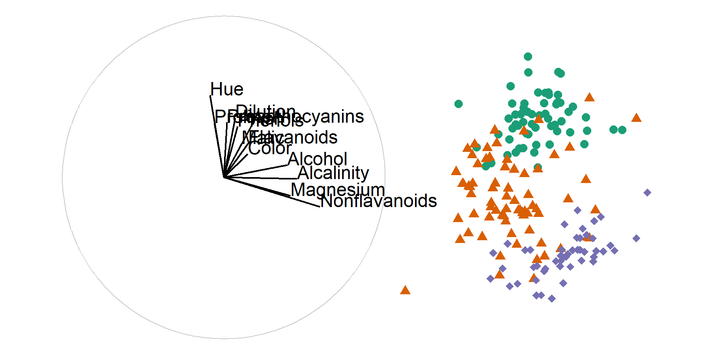
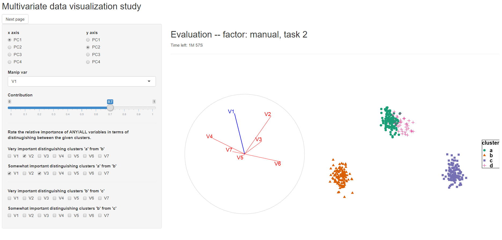

```{r include=FALSE, cache=FALSE}
### For appendix, somehow causing issue while commented.
        # after_body: spyrison-cook-marriott.md
        # after_body: "`r knitr::knit('../spinifex_study/paper/spyrison-cook-marriott.Rmd')`"

### Keep it simple! No R code in .rmd, use a seprate .r script if need be.
library(knitr) 
knitr::opts_chunk$set(fig.align = "center",
                      echo = F,
                      fig.pos = "h", 
                      # fig.pos="h" # "h"olds the figure postion reltive to local content
                      out.extra = ''
                      #message = FALSE,
                      #warning = FALSE,
                      #error = FALSE,
                      #collapse = TRUE,
                      #comment = "",
                      #cache = F, 
                      #cache.lazy = FALSE
                      
)

# <!-- # cheatsheet {#sec:cheatsheet}-->
# <!-- A bib reference [@wickham_visualizing_2015].  -->
# <!-- A [Section intro](#sec:cheatsheet) reference, alternatively, section \ref{sec:intro} (with no @; \\ref{sec:intro}). -->
# <!-- ```{r crest, echo=FALSE, out.height = "10%", out.width = "10%", fig.cap = "A caption for crest figure"} -->
# <!-- knitr::include_graphics("figures/can_con/crest.jpg") -->
# <!-- ``` -->
# <!-- A figure \@ref(fig:crest) reference (with @; \\@ref(fig:crest). -->
# ref:myFig-cap) Seprate fig cap
# ```{r step2, echo=F, fig.cap = "(ref:myFig-cap)"}
# # <!-- knitr::include_graphics("figures/can_con/crest.jpg") -->
# ```

```

<!-- Report length: 3,000 -  5,000 words ("6 - 10 pgs" of words) -->
<!-- Proposed report  structure: -->
<!-- # Introduction – Summary of the Research Project: -->
<!-- ## Motivation/current state of the field and an identification of a gap in knowledge -->
<!-- ## Research Objective -->
<!-- ## Methodology/method/data-collection & analysis -->
<!-- # Progress since confirmation -->
<!-- # Proposed Thesis Structure – including a table of the writing  status -->
<!-- # Publications arising from the thesis – published or planned -->
<!-- # Potential issues for the panel to consider -->
<!-- ## Resources/funding requests -->
<!-- ## Absence of student/supervisor -->
<!-- ## Other issues. -->


<!-- An abstract summarizes, usually in one paragraph of 300 words or less, the major aspects of the entire paper in a prescribed sequence that includes: 1) the overall purpose of the study and the research problem(s) you investigated; 2) the basic design of the study; 3) major findings or trends found as a result of your analysis; and, 4) a summary of your interpretations and conclusions. -->


# Introduction {#sec:intro}

## Motivation 
<!-- objectively, why research is important -->

<!-- Visuals are important for EDA -->
The term exploratory data analysis (EDA) was coined by @tukey_exploratory_1977, who leaves it as an intentionally broad term that encompasses the initial summarization and visualization of a data set. This is a critical first step of checking for realistic values and validating model assumptions. It may be tempting to review a series of summary statistics to check model assumptions. However, there are known datasets where the same summary statistics miss glaringly obvious visual patterns [@anscombe_graphs_1973; @matejka_same_2017]. It is strikingly simple to look at the wrong, or incomplete set of statistics needed to validate assumptions. Data visualization is fast, versatile, and robust relative to the alternative of numeric statistical summarization. Data visualization does and must remain a primary component of data analysis and model validation.

<!-- high-dimensional challenge -->
Data and models are typically **high-dimensional**, with many variables, and possibly many model parameters. Conventionally, $n$ is used for the number of sample observations, and $p$ is used for the number of variables. Developing new methods to visualize high dimensions has been a pursuit of statisticians, computer scientists and visualization researchers for decades. While automated analysis is the norm, there remains some benefit of user interaction to help the analyst understand results, and determine the importance of components in a model. An interplay between automated and human-centered control is useful. As technology changes, new approaches to user interaction emerge, and exploring these technologies provides a challenge to researchers.

<!-- There continues to be tension and back-and-forth on automated- and manual- analysis. Hardware advances allow for more realistic virtual-, augmented-, and mixed- environments with ever-increasing computing power. The degree of analyst choice and interaction with the display dimension should be explored.-->


<!-- Visual methods are needed for high-d data -->
<!-- Consider tabular data containing many attributes (I will use attribute and variable as synonymous). Plotting 2 attributes makes an XY scatterplot. To explore a 3rd variable extend it in the z-axis orthogonal to the XY plane. Further increasing the dimensionality quickly becomes non-trivial. Yet, we know that visualizing data is crucial to the exploration of that space. More options should be made available to the analysts' toolkit for exploring high dimensional spaces.-->

<!-- Adding plotting dimensions -->
Linear projections are commonly used to reduce the dimensionality. A **linear projection** is the linear transformation of the $p$-dimensional space into a low-($d-$)dimensional space, by matrix multiplication of the data with an orthonormal $p\times d$ basis. An orthonormal basis has columns that are orthogonal to each other, and of length 1. 

<!-- This transformation is defined by a 'basis'. A basis is an orthonormal set of `d` element vectors, where each element vector is a linear combination of `p` elements in vector-space. That is to say, a basis defines the direction and magnitude each of the `p` attributes contributes to every direction of the `d`-dimensional projection space. Consider a 2D projection-space (`d = 2`). The basis defining this projection can be visually displayed as a unit circle with `p` line segments stemming from the origin as shown in figure \@ref(fig:basis).-->

<!-- what do we learn from a linear projection -->
Good linear projections are often found with an automated procedure, like principal component analysis [PCA; @pearson_liii._1901] or projection pursuit (@kruskal_toward_1969). These reduce the dimensionality and reveal something interesting about the data. Figure \ref{FIXME:XXX} shows a $d=2$ dimensional projection of $6D$ data, revealing clustering of labelled groups. The basis that produced this projection is 

<!--  [1,]  0.39428  0.075844 -->
<!--  [2,]  0.10865  0.209938 -->
<!--  [3,]  0.17610  0.328622 -->
<!--  [4,]  0.45434 -0.007852 -->
<!--  [5,]  0.41295 -0.112694 -->
<!--  [6,]  0.08576  0.316601 -->
<!--  [7,]  0.15149  0.210671 -->
<!--  [8,]  0.59660 -0.182590 -->
<!--  [9,]  0.01852  0.341373 -->
<!-- [10,]  0.14950  0.144789 -->
<!-- [11,] -0.08701  0.510752 -->
<!-- [12,]  0.06950  0.371095 -->
<!-- [13,] -0.05867  0.339682 -->

\begin{equation*}
\left[ \begin{array}{rr}
 0.394 &  0.075 \\
 0.108 &  0.209 \\
 0.176 &  0.328 \\
 0.454 & -0.007 \\
 0.412 & -0.112 \\
 0.085 &  0.316 \\
 0.151 &  0.210 \\
 0.596 & -0.182 \\
 0.018 &  0.341 \\
 0.149 &  0.144 \\
-0.087 &  0.510 \\
 0.069 &  0.371 \\
-0.058 &  0.339 \\
\end{array} \right]
\end{equation*}

```{r basis, echo = FALSE, out.width = "100%",                               fig.cap = "FIXME CAP NEEDED."}

```
Projection + Data (original)

Projection + Data (one variable rotated out, with no effect to structure)

Projection + Data (one variable rotated out, with structure lost)

Figure \ref{FIXME:XXX} shows how **sensitivity of structure** in a projection can depend on variables contributing to the projection. When variable XXX is rotated out, there is no change to the structure, clusters are still visible. This says that the structure *is NOT sensitive* to variable XXX. When variable XXX is rotated out, there is change to the structure, clusters are less visible. This says that the structure *is sensitive* to variable XXX. 

Exploring the sensitivity of structure in a projection to the contributions of particular variables requires **geodsic interpolation** to remove the variable from (or into) the projection plane. Geodesic interpolation is effectively a rotation, it maintains orthonormality of all new data projections, and any intermediate projections. Geodesic interpolation is used in tour methods (FIXME: REF), which show (automated) movies of low-dmensional projections of high-dimensional spaces. The `tourr` package [@wickham_tourr:_2011] in R provides a range of automated tours. 

Sensitivity analysis is ideally achieved with **user-controlled steering** where the human controls the rotation of a variable into and out of a projection. This will enable various intermediate states to be shown to better understand the effect of single variables. 


```{r basisStructure, echo = FALSE, out.width = "100%",                             fig.cap = "FIXME: CAP NEEDED."}
knitr::include_graphics("./figures/basisStructureWINE.png")
```

<!-- Adding plotting dimensions 
Linear projections are commonly used to mitigate the difficulty of exploring such large data-spaces. A linear projection is the linear transformation of the vector space. This transformation is defined by a 'basis'. A basis is an orthonormal set of `d` element vectors, where each element vector is a linear combination of `p` elements in vector-space. That is to say, a basis defines the direction and magnitude each of the `p` attributes contributes to every direction of the `d`-dimensional projection space. Consider a 2D projection-space (`d = 2`). The basis defining this projection can be visually displayed as a unit circle with `p` line segments stemming from the origin as shown in figure \@ref(fig:basis).
-->


<!--Many classical methods identify one or more projections of interest. For instance, scatterplot matrices [@chambers_graphical_1983] can be used to rapidly valid univariate supports and distributions. Principal component analysis [PCA; @pearson_liii._1901] and biplots [@gabriel_biplot_1971] highlight full sample variation. Linear discriminant analysis [@fisher_use_1936] and penalized discriminant analysis [@hastie_penalized_1995] can be used to identify projection with cluster separation. These are great techniques and all applicants for numeric data with many attributes, however, they have two notable features: they show only 1 or several _discrete_ projections and they do not allow for an analyst to steer or control.


## From discrete to continuous-->

<!-- Grand Tour 
The above methods have suggested a _discrete_ number of linear projections to look at. At the same time, the stool example illustrates that looking at intermediate views improves understanding. A _continuous_ animation of the object being rotated would improve this understanding even further. This is analogous to the idea of a data visualization _tour_[@asimov_grand_1985; @buja_grand_1986]. A tour produces a relatively high number of linear projections and typically displays them in quick succession as an animation. When the bases have a relatively small change in the contributions the projections are much closer. Single points and features can be tracked and followed from projection to projection allowing for a better understanding of the local structure.

The intermediate bases between two bases much are calculated with some care. For instance, a basis for the midpoint between two other is not the mean of each respective element, as the result would not be orthonormal. Instead, the interpolation of intermediate bases must be on 'surface' the possible orthonormal bases. A _geodesic_ curve is the "straight line" on the surface that contains the shortest path between the two bases. This is why airplanes appear to have a curved flight path when seen on a 2D representation of the Earth. Bases that lie on this path can be identified through the use of _geodsic interpolation_-->

<!-- knowledge gap 
The path that a tour animates is a crucial feature. There are various types of tours, many of which select an arbitrary or function-driven path. All of the discrete techniques also highlight a specific feature. For EDA it is desirable to give the analyst the ability to choose the direction to explore. To explore higher dimensional spaces visually, we need _human-in-the-loop_ [@karwowski_international_2006] tools. [@cook_manual_1997] introduces the idea of the _manual_ tour. In a manual tour, an individual variable is selected and its contribution to the projection basis is then controlled. This allows analysts to choose the direction of exploration.

Figure \@ref(fig:manipSp) illustrates a manipulation space. the basis we viewed before is shown in blue and unselected variables in grey on a horizontal plane. while the manipulation space extends above it in red. The contribution that V1 has on the blue projection plane can be controlled as though a hand might manipulate the end of the red line segment. The other variables would perform a constrained rotation, maintain orthogonality of the space.-->


<!-- Relatively small changes in the projection basis allow for features to be tracked from frame to frame. The manual tour allows for the control of a selected variable. In culmination, this should allow an analyst to explore the sensitivity of structure in the projection relative to the variables contributing to the projection. 


The discrete methods above, identify discrete bases that highlight some feature. The above tours can help convey more continuity of data through many small changes in the basis. For EDA it is desirable to give the analyst the ability to choose the direction to explore. 

## Controlling 2D projections

The manual tour can play a predefined manual path or be used interactively, where the user defines each subsequent step while viewing the current projection. The later, human-in-the-loop method we define as _User-Controlled Steering_ (UCS) specifically as the interactive, human-in-the-loop application of the manual tour.

However, the level of abstraction from projecting variable-space and the sheer number of input permutations is formidable. The expertise or time required to explore such structural changes may prove to be a significant barrier to use. The idea that UCS will provide digestible improvements to the understanding of structure should be validated.-->


## Research objectives

The overall question of interest is:

**Can geodesic interpolator with user interaction help analysts understand linear projections of data, and explore the sensitivity of structure in the projection to the variables contributing to the projection?**

which is divided into these more focused objectives:

1. **How do we define user interaction for a geodesic interpolator to add and remove variables smoothly from a 2D linear projection of data?**\
@cook_manual_1997 described an algorithm for manually controlling a tour ($p$-D into 2D), to rotate a variable into and out of a 2D projection. This algorithm provides the start to a human controlled geodesic interpolator. It will be adapted so that the user has more control of the interpolation. The user will be able to set the range of motion from full (-1 to 1) to partial ($\alpha, \beta$), to allow the user to intercept the rotation at any step, and to output to a device that allows the user to reproduce motions and animate or rock the rotation backwards and forwards. These fine-tuned controls will provide a better tool for sensitivity analysis.

<!--The algorithm will be adapted to create the geodesic interpolator. Input will be a single initialization projection, a $p$-dimensional data matrix, as well as, choice-, magnitude- and direction-, of a variable to control.-->
 

2. **Do analysts understand the relationship between variables and structure in a 2D linear projection better when the geodesic interpolator is available?**\
Current practice for high-dimensional data is to make a single low-dimensional representation, with a method such as principal component analysis (PCA). Often just the first two principal components are shown, which is equivalent to a 2D projection. This technique is also called a biplot. Another more rarely used technique is a tour, which shows an animation of 2D projections. It can be used to get an overview of the structure in the multivariate space, but it is difficult to assess the importance of variables to a particularly interesting low-dimensional structure. A human subject study has been designed and conducted to assess the learning about the importance of variables, from each of these techniques. 

3. **Can we define a geodesic interpolator for 3D projections, so that the technology can be implemented in modern virtual reality environments?<!-- How can the manual tour be extended to 3D?-->**\
The cutting edge of visualization research today is in virtual environments, as technology has advanced to make this accessible to the masses. It is interesting to explore how analysis with 3D graphics operates in comparison with 2D graphics. Building a geodesic interpolator for 3D projections extends the technology from 2D to 3D, and will allow us to compare the benefits or not, of the new environment for analyzing with multivariate data.

4. **Does 3D provide advantages over 2D, when exploring low-dimensional projections, for understanding structure in high-dimensional data? <!-- manual tours provide benefits over alternatives?-->**\
@gracia_new_2016 compares analyst tasks between 2- and 3-D scatterplots. They find modest accuracy and error improvements for distance perception and outlier identification in favor of 3D at the cost of a relatively small increase in task time. @nelson_xgobi_1998 similarly compare a 2D projection and its 3D  manipulation space. They find a slight advantage in the sphere test and a large advantage in the cluster test in favor of the 3D manipulation space. A human subjects experiment will be conducted to assess the sensitivity analysis techniques in a 2D vs 3D environment.


## Methodology

This research is interdisciplinary; touring was developed by statisticians to explore physics data. Modern advances in hardware from information technology allow for 3D rending in higher quality and immersion than previously possible. 

The research corresponding with RO #1 entails _algorithm design_ following and further clarifying the work done in @cook_manual_1997. Adaptations of the algorithm include defining the axis of rotation for manipulation orthogonal to the projection plane. This allowed us to then apply Rodrigues' rotation formula [@rodrigues_lois_1840] to prove the rotation matrix to be used in 2D. We also provide initialization of the in- and out- of plane angles of rotation which clarifies understanding and application of the manual tour.

In the application, attention was given to both pre-compiled tour and human-in-the-loop UCS. We provide an open-source version of the manual tour in the R package, `spinifex`, which has since been published on CRAN. This forms the foundation for future work in the remaining objectives. In the related paper we additionally apply the algorithm on particle physics data.

For RO #2 is a controlled _experimental study_ to explore the efficacy of interactive UCS compared with the benchmarks factors of PCA and the grand tour. This is designed as a within-participant study where each participant performs all factors. the study is balanced by assigning participants into one of 3 groups where the factor order is controlled by a Latin square while simulation order remains the same. The details are discussed in finer detail in section (#sec:expStudy), below.

The research for RO #3 involves _algorithm design_ extending the current 2D manual tour into a 3D project. For a 2D projection, the axes basis is rotated through a 3D 'manipulation space'. In a 3D projection, such a space requires 4 dimensions. Theoretically, after the addition of a new angle of rotation, the rotation matrix must be extended to accommodate a new dimension and angle parameter. This also means that analysts have another parameter to define, further increasing their already sizable input-volume. 

<!-- #TODO: _experimental study_  FOR RO4 -->

# Progress since confirmation

During the candidature confirmation review (27 March 2019) we discussed exploratory data analysis, visualization of high dimensional spaces, covered the literature for tours and 3D rendering for information perception. We concluded with the progress for appending the algorithm for the manual tour (RO # 1), software application in R, and its use on particle physics data.

## Publication

The paper showcasing the revied algorithm, software, and use case, has since been accepted in the R Journal and it currently undergoing editorial review. This will be published in the first issue of 2020 and will be made available at [journal.r-project.org](https://journal.r-project.org/).
<!-- Is there a pre-print version to cite? -->

## Software

The R package, `spinifex (v0.1.0)` [@spyrison_spinifex_2019], has been approved and hosted for public use on the Comprehensive R Archival Network, CRAN (cran.r-project.org/web/packages/spinifex/)(https://cran.r-project.org/web/packages/spinifex/index.html).

New functionality has been added to the development branch, specifically around the interactive use. A user application is developed with `shiny`[@chang_shiny:_2018]. It allows users to explore their data without the need for coding familiarity. It features interactive or precompiled manual touring. It also contains a gallery for flagging bases which can then further be reviewed or saved as .gif and .png files.

## Experimental study {#sec:expStudy}

The prominent appeal of the manual tour is that it allows users to control the contributions of individual variables. In theory, this should enable the finer exploration of features of interest. The hypothesis we will study is _Does the finer control afforded by the manual tour improve the ability of the analyst to understand the importance of variables contributing to the structure?_

We list out an abbreviated summary of the experimental design in the subsections below. A more detailed draft of the working paper is included as an appendix. 


### Groups {#sec:groups}

Each participant will be randomly split into one of three even groups. The group controls the order of the factors that the participant was evaluated in for a latin square of the 3 factors. For instance, the order of the first group was PCA, grand, manual. Group level only impacts the order the factors are displayed while task, block, and simulation order will remain the same. 


```{r designExample, echo = F, out.width = '80%',                             fig.cap = "Example case. Person 'A' is assigned to group 2, where they will use factor 2 (grand tour) for the first period. They perform 3 block difficulties of task 1 on simulations of increasing difficulty. Then 3 block difficulties of task 2 on unique simulations sampled from the same distributions of increasing difficulty. After this, they proceed to period 2, where they are use factor 3 (manual tour) to perform 3 block difficulties of each task. Lastly, in the third period, they use factor 1 (PCA) to perform the tasks."}
knitr::include_graphics("./figures/experimental_design_personA.PNG")

```

### Factors {#sec:factors}

<!-- factors: PCA, grand, manual -->
We will explore performance across three factors. The first factor is Principal Component Analysis (PCA). The second factor is an animated walk of interpolation frames between target bases, called a _grand_ tour. The third factor allows for the manual control of the individual variable's contribution to the projection, performing a _manual_ tour.

<!-- Plot and axes -->
All factors are shown as a scatterplot. The basis axes projection was also illustrated to the left of the plot. They are shown in a unit circle and show the magnitude and direction each variable contributes to the projection.

<!-- interface differences -->
The user interface was kept the same whenever possible, but the control inputs do change slightly to accommodate the differences between factors. The inputs for  PCA select a pair of principal components to display on the x- and y-axes. The manual tour had the same axes selection, with the addition of a drop-down bar and slider control selecting the manipulation variable and magnitude. The grand tour comes precompiled as an animation of a 15 second showing 90 frames at 6 frames per second. The user can control the location or play/pause the animation at will.


### Tasks {#sec:tasks}

Within each factor, participants will perform 2 tasks. The first task asks participants to identify the number of clusters present in unsupervised data. This task served as a standard for assessing the general aptitude for this sort of high dimensional analysis as it was simpler. In application, linear discriminant analysis [@fisher_use_1936] or penalized discriminant analysis [@hastie_penalized_1995] are better suited for classifying such unsupervised data.

The second task is focused on the hypothesis of the study, it asks participants to identify any/all variables that were very important and somewhat important for distinguishing a given cluster from the others. For instance, which variables are very- and somewhat- important for distinguishing clusters 'A' and 'B'.


### Block difficulty {#sec:blocks}

Participants will be randomly assigned to 1 of 3 even groups. Each group has a  different factor order containing all factors. Both tasks will be performed in the same order. Each task will have 3 repetitions performed on new simulations that were drawn from 3 parameterizations in increasing difficulty. Each participant will go through the simulations in the same order, while their factor order will vary. Fixing block difficulty order while varying factors should mitigate potential learning bias.

### experimental apperatus

The user interface was kept the same whenever possible, but the control inputs did change slightly to accommodate the differences between factors. For example, PCA has 2 radio button inputs selecting principal components to display on the x- and y-axes. The manual tour had the same axes selection, with the addition of a drop-down bar selecting manipulation variable and slider controlling its magnitude. Figure \@ref(fig:basis) shows the interface for the manual tour during task evaluation.

```{r appManualFactor, echo=FALSE, out.width = "80%", out.extra = '', fig.cap = "Interface for the manual tour factor in the evaluation section."}

```

### Pilot studies

There have been 3 small iterations of pilot studies. The first 2 iterations identified many small behavioral, wording changes, interactions to log. The latest pilot shows similar results between the PCA and manual factors suggesting that the simulations may be too simple to gain any improvement with the additional capability of being able to change variable contribution. New simulations will be drawn before continuing to the next round of pilot studies.

Another common remark from pilot participants was the expression of concern that they aren't familiar enough with the factors to give valid results. Verbal and written wording have been modified to stress that factors are being assessed and not the participant's performance and reaffirmation that they are representative of the sample population.  


# Next steps

## Extending manual tour to 3D

To perform the 2D manual tour, two angle parameters must be identified to perform a rotation of the 3D manipulation space. The angle $\theta$ indicates the angle on the projection plane between the manipulation variable and the `x-axis`. While $\phi$ is the angle that the variable extends into the manipulation space above the projection plane.

A 3D manual tour then must define 3 angle parameters that define the rotation of the 4D manipulation space. Let $\theta$ now be a set of 2 angles, $\{\theta_{xy}, \theta_z\}$ that defines the position of the manip variable in the (3D) projection plane and $\phi$ in the angle it extends into the manipulation direction.

Special care must be taken defining the axis of rotation from the 3D projection into the 4D manipulation space. In particular, the signs will need attention not to be lost especially of trigonometric functions that only support half a rotation. Once this task is done the 4D rotation matrix must be solved, again with the application of Rodrigues' rotation formula [@rodrigues_lois_1840].


## User application of a 3D manual tour

In RO #2, a `shiny` application was developed and used to explore the effect of user interaction for understanding variable contributions to structure in linear projections. It did so but exploring the differences in performance between 2D biplot of principal components, a 2D grand tour, and a 2D manual tour. 

Another R package, `shinyaframe`, {@murphy_shinyaframe_2017} that enables the use of Mozilla's `aframe` VR product to be consumed in `shiny` applications. The section titled 'Method 2: “A-Frame and R (Shiny, Ggplot2”)' by @hadjar_webvr_2018 is an example of an application with the relevant packages and hardware for display and interaction in stereoscopic virtual reality. This may allow for more rapid advancement in implementation, however, the extent and extendability of interaction remain unknown.

Alternatively, development and application in the game engine Unity would allow for all types of interactions but would likely result in a longer development period. 


# Proposed thesis structure

## Thesis structure

Subjective estimation of completion of first draft of thesis chapters:

- Introduction -- 60%
- Literature review -- 80%
- Manual tour and user-controlled steering -- 90%
- Experimental study -- 60%
- The extension of the manual tour to 3D -- 0%
- Conclusion and future plans -- 0%

Figure \@ref(fig:timeline) illustrates the purposed timeline for of this research.

```{r timeline, echo=FALSE, out.width = "100%", out.extra = '', fig.cap = "Proposed research timeline."}
knitr::include_graphics("figures/phd_timeline.PNG")
```

## Program requirements
<!-- http://www.monash.edu/pubs/2018handbooks/aos/information-technology-phd-program/ -->

- WES Academic record
    - FIT5144: 2019 S1+2, **In progress**, extended to the pre-submission seminar with the unit coordinator for the usual 2 opportunities to complete.
        - Hours: 147>120 hours __Tracked__, missing the following requirments (12 hr total)
        - _Needed:_ CYR 2 (A & B) -- 2x 3hr 
        - _Needed:_ Faculty of IT Workshop 1 and 3 on Ethical Research and Publishing -- 2x 3hr
    - FIT5113: 2018 S2, **Exemption**
    <!-- (submitted:08/2018, recorded 4/2019) -->
    - FIT6021: 2018 S2, **Completed** with distinction
- myDevelopment - IT: Monash Doctoral Program - Compulsory Module
    - Monash graduate research student induction: **Completed** 
    <!-- last assesed: 20/02/2018 -->
    - Research Integrity - Choose the Option most relevant: **Completed** 
    <!-- Last Accessed:    20/02/2018 (2 of 4 required & completed) -->
    - Faculty Induction: **Completed** 
    <!-- marked completed, online class "08/05/2019 @ 09:45 for 3hr 15min" -->
    <!-- previously: **Content unavailable** (01/04/2019: "Currently being updated and will be visible in this section soon") -->
    

# Potential issues for panel to consider

## Funding for human subjects

- Beverage voucher: \$6 x 25 people (est) = \$150  

## Support for conference travel

__Conferences:__\
\
IEEE VAST 2020: 25-30 October 2020 Salt Lake City, Utah, USA\
submission: Saturday, March 21, 2020\
<!-- (+ 10 days for full) VAST - Empirical Study\ -->
http://ieeevis.org/year/2020/info/call-participation/vast-paper-types
\
IEEE VAST 2020: 25-30 October 2020 Salt Lake City, Utah, USA\
submission: Saturday, March 21, 2020\

# Acknowledgements {#sec:acknowledgements}

This report was created in `R` [@r_core_team_r:_2019] using `rmarkdown` [@xie_r_2018].

For version control, transparency, and reproducibility, the source files are made available found at [github.com/nspyrison/mid_candidature](https://github.com/nspyrison/mid_candidature).


# References 