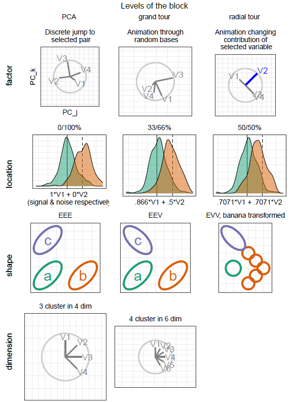
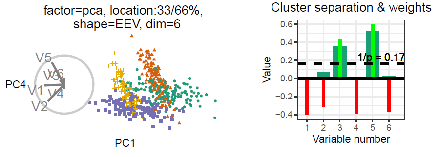
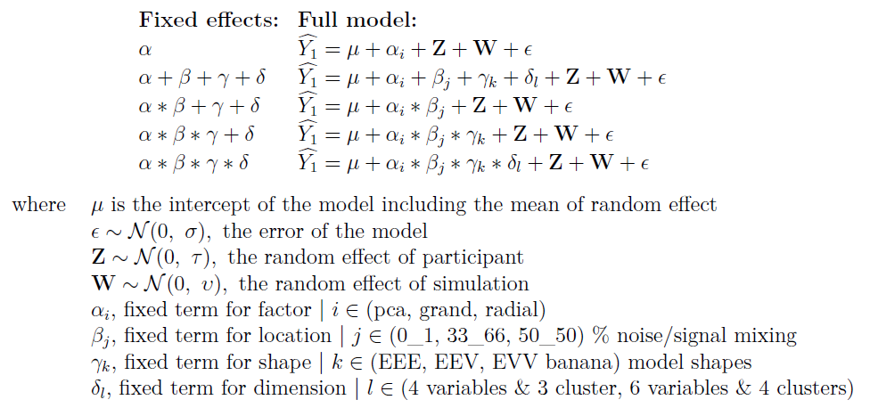
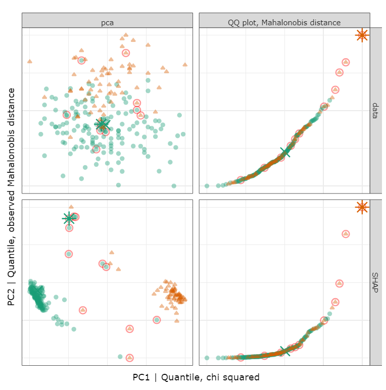
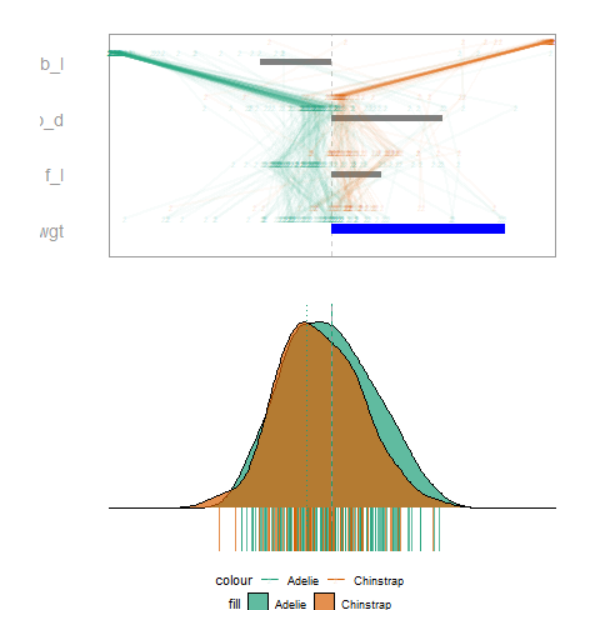

```{r include=FALSE, cache=FALSE}
library('knitr') 
knitr::opts_chunk$set(
  fig.align  = "center",
  echo       = FALSE,
  cache      = FALSE,
  cache.lazy = FALSE
)
```

<!-- # cheat sheet {#sec:cheatsheet} -->
<!-- A bib reference [@wickham_visualizing_2015]. -->
<!-- A [Section intro](#sec:cheatsheet) reference, alternatively, section ef{sec:intro} (with no @; \\ref{sec:intro}). -->
<!-- ```{r crest, echo=FALSE, out.height = "10%", out.width = "10%", fig.cap = "A caption for crest figure"} -->
<!-- knitr::include_graphics("./figures/crest.jpg") -->
<!-- ``` -->
<!-- A figure \@ref(fig:crest) reference (with @; \\@ref(fig:crest). -->
<!-- ref:myFig-cap) Separate caption created above the R chunk -->
<!-- ```{r step2, echo=F, fig.cap = "(ref:myFig-cap)"} -->
<!-- knitr::include_graphics("./figures/crest.jpg") -->
<!-- ``` -->

# Introduction {#sec:intro}
<!-- WHAT TOPICS -->

<!-- multivariate vis, tours -->
The thesis of this work is central to multivariate data visualization. More specifically, we focus on the class of many linear projections viewed near-continuously through small changes to the projection basis known as data visualization _tours_ [@cook_grand_2008, @lee_review_2021].

<!-- manual tour, RO 1 -->
There are many variants of tours. We focus on one branch, _manual tours_ [ @cook_manual_1997, @spyrison_spinifex_2020], that allows for user interaction by selecting one variable and specifying how to change its contribution to the current projection. By controlling the contribution of a single variable, a user can explore its sensitivity to the structure of the projection and identify which variables are ultimately most important to the structure in question. The work addressing the first research objective clarified the rational for doing so and implements a free, open-source `R` package for applying the manual tour.

<!-- manual tour, user study, RO2 -->
Next, we substantiated the efficacy of manual tour as compared with discrete combinations of principal components [@pearson_liii._1901] and the _grand tour_[@asimov_grand_1985]. We do so with a $N=108$ within-participant user study, where all participants use each of these visual factors. This is performed over balanced trials across the other experimental factors: location, shape, and dimension of the data. This addresses the second research objective.

<!-- XAI, SHAP values, and RO3 -->
In our latest work, we want to see if we can apply the manual tour to aid the interpretability of complex, black-box models. One recent branch in explainable artificial intelligence (XAI, @adadi_peeking_2018, @arrieta_explainable_2020) is the use of local explanations or attribution of the variables for one observation of an agnostic black-box model. One local explanation is the SHAP values [@lundberg_unified_2017, EMA?]. We use these SHAP values as a 1D basis and perform manual tours to explore how the SHAP values behave differently for misclassified and class-corrupted observations against neighboring correctly classified observations. This work corresponds to the third research objective


# Motivation
<!-- WHY/IMPORTANCE OF THESE TOPICS -->

<!-- EDA, visuals are important, numeric summarization insufficient -->
The term exploratory data analysis (EDA) was coined by @tukey_exploratory_1977, who leaves it as an intentionally broad term that encompasses the initial summarization and visualization of a data set, before a hypothesis to test has been formulated. This is a critical first step for understanding and becoming familiar with data and validating model assumptions. It may be tempting to review a series of summary statistics to check model assumptions. However, there are known datasets where the same summary statistics miss glaringly obvious visual patterns [@anscombe_graphs_1973; @matejka_same_2017]. It is shocking easy to look at the wrong, or incomplete set of statistics needed to validate assumptions. Data visualization is crucial in EDA, it _forces_ you to see details and peculiarities of the data which are opaque to numeric summarization, or more nefariously, obscure their true values. Data visualization do and must remain a primary component of data analysis and model validation.

<!--interaction, wants citations -->
##TODO:XXX citations
While static documents are the norm, there are sizable benefits of user interaction. Interactive data visualization shift the locus of control back to the user, inviting them to explore and interact with the data, and offers a compact way to explore a wider range of dimensions, questions, and keep the curiosity and interest of the user.

<!-- Black box, interprebility vs accuracy -->
With the emerging filed of XAI, the constant tension between interprability of a model and its predictive power is receiving more attention. Linear models are the champions of interprability with modest accuracy while increasing complex models improve accuracy but they can scarsly be interpreted even by experienced practitioners. One way to gain insight into a model is to focus on the local vicinity of one observation, and explain the variable weighting around that location, in an agnostic non-linear model. We call this observation level variable weights a _local explaination_[@biecek_explanatory_2021]. There are various such local explanation, many are tied to specific classes of models, while others are model-agnostic. LIME[@] and SHAP[@] are two such examples.

<!-- summary -->
We know that data visualization is important in EDA and assumption validation. User interaction allows us to explore widely and quickly while allow us to explore ideas as they arise. These two elements were used to answer the first RO. Their efficacy was supported in response to the second RO. In this work we apply manual tour in tandem with SHAP local explanations to address the third RO.


# Research objectives
<!-- Hypothesis statement -->

The overall question of interest is:

**Can the geodesic interpolator with user interaction help analysts understand linear projections of data, and explore the sensitivity of structure in the projection to the variables contributing to the projection?**

Which is further divided into these more specific objectives:

1. **How do we define user interaction for the geodesic interpolator to add and remove variables smoothly from a 2D linear projection of data?**\
@cook_manual_1997 described an algorithm for manually controlling a tour ($p$-D into 2D), to rotate a variable into and out of a 2D projection. This algorithm provides the start to a human-controlled geodesic interpolator (GI). The work[@spyrison_spinifex_2020] adapted so that the user has more control of the interpolation. The user is able to set the range of motion from full $[-1, 1]$, to allow the user to intercept the rotation at any step, and to output to a device that allows the user to reproduce motions and animate or rock the rotation backward and forwards. These fine-tuned controls  provide a better tool for sensitivity analysis.

2. **Do analysts understand the relationship between variables and structure in a 2D linear projection better when the geodesic interpolator is available?**\
We performed an $N=108$, within0participant user study comparing accruacy and time with the primary factor as type of data visualization. Each particiapnt performed 2 evaluations with either discrete PCA, grand tour, or radial manual tour. We find strong evidence that the radial tour increases accuracy. We also show the effects from the other experimental factors of location, shape data dimensionality, and the random effects from the data and that of the participants.

3. **Can we use the geodesic interpolator in conjunction with the local explaination SHAP to improve the interprability of  black-box models?**\
The tension from the trade off between accuracy and interprability of black-box models is rising. Below we use SHAP to extract local explanations from a random forest model and use those SHAP values as a projection basis to perform manual tours on. We add class-corrupted observations and explore how the model and shap values react.


# Methodology
<!-- HOW YOU WILL GO ABOUT EACH PROJECT -->

The research corresponding with RO #1 entails _algorithm design_ adapting the algorithm from @cook_manual_1997. This allows for interactive control of 2D projections and serves as a foundation from the remaining work to follow. 

To address RO #2, a controlled _experimental study_ has explored the efficacy of interactive radial tour as compared with two benchmark methods: Principal Component Analysis (PCA, @pearson_liii._1901) and the grand tour[@asimov_grand_1985]. This was a within-participant user study where each participant experienced each of visual factors. Trials were balanced across 3 other experimental factors: _location_ of the signal, _shape_ of the cluster distributions, and _dimension_ the data.

The research for RO #3 involves _algorithm design_. We know that the SAHP value are a local explaination for one observation. This SHAP value will also serve as the 1D basis for the manual tour. While using SHAP as a projection basis is novel it is not particularly insightful by itself. We provide tracking marks for the selected observation, a comparison neighbor as the basis changes. We also offer a view and quantitative analysis for the data and full SHAP matrix to keep the local view in context and measure how extreme the shap values are behaving.


# Canidature progress

In candidature confirmation review we discussed the implementation of the _geodesic interpolator_ with user interaction (RO #1) which resulted in the open-source R package, `spinifex` available on CRAN and its subsequent publication [@spyrison_spinifex_2020]. 

In min-candidature review we discussed the experimental design of the user study to substantiate the efficacy of the radial tour as compared with PCA (discrete with user interaction), and the grand tour (continuous without user interaction). Below we briefly report our findings before discussing the work addressing RO#3.


## Experimental study {#sec:expStudy}

The $N=108$ within participant user study collected 6 trials from each particiapant (648 total), with 2 trials of each of visuals: PCA, grand tour, and radial tour. Three further factors: location, shape and data dimensionionality were also evenly evaluated for a comparison with the effect of controlling the visuals.

In summary we use a mixed regression model, using the factors above as main effects and use the participant and data simulations as random effects. We regress on $Y_1$, accuracy, and $Y_2$, log time. We test increasingly complex interactions of the main effects, but settle on the following model to look at the coefficient output.

$$
\begin{array}{ll}
&\widehat{Y} = \mu + \alpha_i * \beta_j + \textbf{Z} + \textbf{W} + \epsilon \\
\text{where } &\mu \text{ is the intercept of the model including the mean of random effect} \\
&\epsilon   \sim \mathcal{N}(0,~\sigma), \text{ the error of the model} \\
&\textbf{Z} \sim \mathcal{N}(0,~\tau), \text{ the random effect of participant} \\
&\textbf{W} \sim \mathcal{N}(0,~\upsilon), \text{ the random effect of simulation} \\
&\alpha_i \text{, fixed term for factor}~|~i\in (\text{pca, grand, radial}) \\
&\beta_j  \text{, fixed term for location}~|~j\in (\text{0\_1, 33\_66, 50\_50}) \text{ \% noise/signal mixing} \\
&\gamma_k \text{, fixed term for shape}~|~k\in (\text{EEE, EEV, EVV banana}) \text{ model shapes} \\
&\delta_l \text{, fixed term for dimension}~|~l\in (\text{4 variables \& 3 cluster, 6 variables \& 4 clusters}) \\
\end{array}
$$

```{r studyResults, echo=FALSE, out.width = "49%", out.extra = '',fig.show='hold',fig.align='center', fig.cap = "Model coefficients regressing against our accuracy measure (left) and log time (right). We have strong evidence supporting a relatively large increase in accuracy with the radial tour. We also notice that there is some evidence suggesting that use of the grand tour is fastest, perhaps because there is no interaction and participants can be devote all of their attention to watching the animation through once."}
# 
# 
# 
knitr::include_graphics(
  c("figures/spinifex_study_y1_results.PNG",
    "figures/spinifex_study_y2_results.PNG"))
```

A more in depth description and discussion of this user study is attached as appendix A, a draft version of a paper we intend to submit to the Journal of Data Science, Statistics, and Visualization.


## Trees of Cheem


### SHAP values and prediction explainations.

####TODO:XXX
This is a variable weighting in the vicinity of one observation, but we also which to keep the global distribution in mind.
We provide a global context of the SHAP values, comparing the skew of the distribution.

```{r cheemShapBd, echo=FALSE, out.width = "100%", fig.align='center', fig.cap = "SHAP vlaues and prediction explainations of an offensive player (Messi, top) and a defensive player (van Dijk). SHAP values show change in weights at the location of each player. Break down profiles show one order sensitive explaination for the prediction of that observation."}
knitr::include_graphics("figures/cheem_fifa_messi_dijk.pdf")
```
```{r cheemAppPenguins, echo=FALSE, out.width = "100%", fig.align='center', fig.cap = "TODO:XXX caption"}

```
```{r cheemAppPenguins2, echo=FALSE, out.width = "100%", fig.align='center', fig.cap = "TODO:XXX caption"}

```
### Trees of cheem

Global view


# Proposed thesis structure

- The coursework, Graduate Research 120 hour are complete and approved.

This is my assessment of the completion of the thesis research thus far:

- Introduction -- 60%
- Literature review -- 80%
- (RO #1) GI \& manual tours -- 90%
- (RO #2) manual tour efficacy user study -- 80%
- (RO #3) manual tour applied to SHAP values  -- 60%
- Conclusion and future plans -- 40%

Figure \@ref(fig:timeline) illustrates the purposed timeline for this research.

```{r timeline, echo=FALSE, out.width = "100%", out.extra = '', fig.cap = "Proposed research timeline."}
knitr::include_graphics("figures/phd_timeline.png")
```

<!-- ## Program requirements -->
<!-- <!-- http://www.monash.edu/pubs/2018handbooks/aos/information-technology-phd-program/ --> 

<!-- - WES Academic record -->
<!--     - FIT5144: 2019 S1+2, **Completed**, extended to the pre-submission seminar with the unit coordinator for the usual 2 opportunities to complete. -->
<!--         - Hours: 147>120 hours **Approved** -->
<!--         - **Completed** CYR 2 (A & B) -- 2x 3hr  -->
<!--         - **Completed** Faculty of IT Workshop 1 and 3 on Ethical Research and Publishing -- 2x 3hr -->
<!--     - FIT5113: 2018 S2, **Exemption** -->
<!--     - FIT6021: 2018 S2, **Completed** with distinction -->
<!-- - myDevelopment - IT: Monash Doctoral Program - Compulsory Module -->
<!--     - Monash graduate research student induction: **Completed**  -->
<!--     - Research Integrity - Choose the Option most relevant: **Completed**  -->
<!--     - Faculty Induction: **Completed**  -->

# Other Contributions

- “Is IEEE VIS *that* good?”, AltVis [@spyrison_is_2021]
- A Review of the State-of-the-Art on tours Dynamic Visualization of High-dimensional Data [@lee_review_2021]
- 1st place in 2020 Melbourne Data Marathon [@barrow_melbourne_2020]

# Acknowledgements {#sec:acknowledgements}

This research was supported by an Australian Government Research Training Program (RTP) Scholarship. This article was created in `R` [@r_core_team_r:_2020] and `rmarkdown` [@xie_r_2018].

For version control, transparency, and reproducibility, the source files are made available at [github.com/nspyrison/phd_milestones](https://github.com/nspyrison/phd_milestones).


# References

<!-- #EVERYTHING BELOW IS UP FOR REMOVAL -->
<!-- ##TODO:XXX -->
<!-- IT IS UNCLEAR IF WE EVEN WANT TO GO INTO THE TERMINOLOGY, If so, I think it wants to go lower, preceeding the work. -->
<!-- <!-- Terminology, linear projections--> -->
<!-- Data and models have continued to increase size, not only in the depth of their observations, but also with the number of variables and features use. Conventionally, we refer to the numeric data as $X$, an [$n \times p$] matrix, with $n$ number of observations, and $p$ numeric variables. Through out my dissertation we will be using __linear projections__ to project or embed this space into a lower, $d-$dimensional, space. This is achieved by post multiplying the data by an _orthonormal_ projection basis, $A$ an [$p \times d$] matrix, where each column-dimension of the projection space are mapped to a linear contribution of the original dimensions. The orthonormal restriction the basis is two-fold. Namely, The basis is orthagonal, with each column-dimension independent-of, or at 90$^{\circ}$, to all other columns. Secondly, that the each column-dimension is 'normal', with a norm or length equal to 1. The under-lying rational for this is to ensure the that projection space is Cartesian volume. -->


<!-- \begin{equation*} -->
<!-- \left[ \begin{array}{rr} -->
<!--   0.70 & -0.50 \\ -->
<!--  -0.27 & -0.52 \\ -->
<!--   0.28 & -0.14 \\ -->
<!--   0.26 &  0.63 \\ -->
<!--   0.08 & -0.16 \\ -->
<!--   0.54 &  0.18 \\ -->
<!-- \end{array} \right] -->
<!-- \end{equation*} -->

<!-- ```{r basis, echo = FALSE, out.width = "100%",                               fig.cap = "Axes vectors of the basis and resulting projection of the data. Data is assigned color and shape by cluster."} -->
<!-- knitr::include_graphics("./figures/basis.png") -->
<!-- ``` -->

<!-- Figure \@ref(fig:basisStructure) shows how the **sensitivity of structure** in a projection can depend on variables contributing to the projection. When variable 'tr1' is rotated out, there is a change to the structure, clusters are less visible. This says that the structure *is sensitive* to variable 'tr1'. When variable 'tr2' is rotated out, there is no change to the structure, clusters are still visible. This says that the structure *is NOT sensitive* to variable 'tr2'. -->

<!-- ```{r basisStructure, echo = FALSE, out.width = "100%",                             fig.cap = "Illustration of sensitivity of cluster structure in the projection as a function of variable contributions. In pane A) the variable 'tr1' is removed and cluster in purple dimonds in no longer separated; 'tr1' is a sensitive to cluster structure. In pane B) 'tr2' is removed and cluster are still distinguished. the variable 'tr' is not sensitive to clustering."} -->
<!-- knitr::include_graphics("./figures/basisStructure.png") -->
<!-- ``` -->

<!-- Exploring the sensitivity of structure in a projection to the contributions of particular variables requires **geodesic interpolation** to remove the variable from (or into) the projection plane. Geodesic interpolation is effectively a rotation, it maintains orthonormality of all new data projections and any intermediate projections. Geodesic interpolation is used in tour methods [cook_grand_2008; @asimov_grand_1994], including the **grand tour** which shows (automated) movies of low-dimensional projections of high-dimensional spaces. The `tourr` package [@wickham_tourr:_2011] in R provides a range of automated tours.  -->

<!-- Sensitivity analysis is ideally achieved with user-controlled steering where the human controls the rotation of a variable into and out of a projection. This will enable various intermediate states to be shown to better understand the effect of single variables. -->