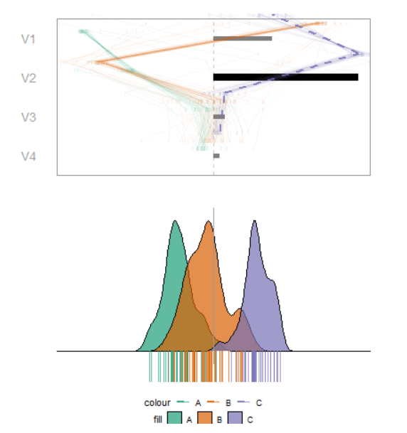

```{r include=FALSE, cache=FALSE}
library('knitr') 
knitr::opts_chunk$set(
  fig.align  = "center",
  echo       = FALSE,
  cache      = FALSE,
  cache.lazy = FALSE
)
```

<!-- # cheat sheet {#sec:cheatsheet} -->
<!-- A bib reference [@wickham_visualizing_2015]. -->
<!-- A [Section intro](#sec:cheatsheet) reference, alternatively, section ef{sec:intro} (with no @; \\ref{sec:intro}). -->
<!-- ```{r crest, echo=FALSE, out.height = "10%", out.width = "10%", fig.cap = "A caption for crest figure"} -->
<!-- knitr::include_graphics("./figures/crest.jpg") -->
<!-- ``` -->
<!-- A figure \@ref(fig:crest) reference (with @; \\@ref(fig:crest). -->
<!-- ref:myFig-cap) Separate caption created above the R chunk -->
<!-- ```{r step2, echo=F, fig.cap = "(ref:myFig-cap)"} -->
<!-- knitr::include_graphics("./figures/crest.jpg") -->
<!-- ``` -->

# Introduction {#sec:intro}
<!-- WHAT TOPICS -->

<!-- multivariate vis, tours -->
The thesis of this work is central to multivariate data visualization. More specifically, we focus on the class of many linear projections are viewed near-continuously through small changes to the projection basis known as data visualization _tours_ [@cook_grand_2008, @lee_review_2021].

<!-- manual tour, RO 1 -->
There are many variants of tours. We focus on one branch, _manual tours_ [ @cook_manual_1997, @spyrison_spinifex_2020], that allows for user interaction by selecting one variable and specifying how to change its contribution to the current projection. By controlling the contribution of a single variable, a user can explore its sensitivity to the structure of the projection and identify which variables are ultimately most important to the structure in question. The work addressing the first research objective clarified the rationale for doing so and implements a free, open-source `R` package for applying the manual tour.

<!-- manual tour, user study, RO2 -->
Next, we substantiated the efficacy of manual tours as compared with discrete combinations of principal components [@pearson_liii._1901] and the _grand tour_[@asimov_grand_1985]. We do so with an $N=108$ within-participant user study, where all participants use each of these visual factors. This is performed over balanced trials across the other experimental factors: location, shape, and dimension of the data. This addresses the second research objective.

<!-- XAI, SHAP values, and RO3 -->
In our latest work, we want to see if we can apply the manual tour to aid the interpretability of complex, black-box models. One recent branch in explainable artificial intelligence (XAI, @adadi_peeking_2018, @arrieta_explainable_2020) is the use of local explanations or attribution of the variables for one observation of an agnostic black-box model. One local explanation is the SHAP values [@lundberg_unified_2017, EMA?]. We use these SHAP values as a 1D basis and perform manual tours to explore how the SHAP values behave differently for misclassified and class-corrupted observations against neighboring correctly classified observations. This work corresponds to the third research objective


# Motivation
<!-- WHY/IMPORTANCE OF THESE TOPICS -->

<!-- EDA, visuals are important, numeric summarization insufficient -->
The term exploratory data analysis (EDA) was coined by @tukey_exploratory_1977, who leaves it as an intentionally broad term that encompasses the initial summarization and visualization of a data set, before a hypothesis to test has been formulated. This is a critical first step for understanding and becoming familiar with data and validating model assumptions. It may be tempting to review a series of summary statistics to check model assumptions. However, there are known datasets where the same summary statistics miss glaringly obvious visual patterns [@anscombe_graphs_1973; @matejka_same_2017]. It is easy to look at the wrong, or incomplete set of statistics needed to validate assumptions. Data visualization is crucial in EDA, it _forces_ you to see details and peculiarities of the data which are opaque to numeric summarization, or more nefariously, obscure their true values. Data visualization does and must remain a primary component of data analysis and model validation.

<!--interaction, wants citations -->
<!-- ##TODO:XXX  -->
<!-- citations for user interaction? hard to find wide, broad studies/support -->
While static documents are the norm, there are sizable benefits of user interaction. Interactive data visualization shift the locus of control back to the user, inviting them to explore and interact with the data, and offers a compact way to explore a wider range of dimensions, questions, and keep the curiosity and the interest of the user.

<!-- Black box, interprebility vs accuracy -->
With the emerging field of XAI, the constant tension between the  interpretability of a model and its predictive power is receiving more attention. Linear models are the champions of interpretability with modest accuracy while increasing complex models improve accuracy but they can scarcely be interpreted even by experienced practitioners. One way to gain insight into a model is to focus on the local vicinity of one observation, and explain the variable weighting around that location, in an agnostic non-linear model. We call this observation level variable weights a _local explanation_[@biecek_explanatory_2021]. There are various such local explanations, many are tied to specific classes of models, while others are model-agnostic. LIME[@] and SHAP[@] are two such examples.

<!-- summary -->
We know that data visualization is important in EDA and assumption validation. User interaction allows us to explore widely and quickly while allowing us to explore ideas as they arise. These two elements were used to answer the first RO. Their efficacy was supported in response to the second RO. In this work, we apply a manual tour in tandem with SHAP local explanations to address the third RO.


# Research objectives
<!-- Hypothesis statement -->

The overall question of interest is:

**Can the geodesic interpolator with user interaction help analysts understand linear projections, and explore the sensitivity of structure in the projection to the variables contributing to the projection?**

Which is further divided into these more specific objectives:

1. **How do we define user interaction for the geodesic interpolator to add and remove variables smoothly from a 2D linear projection of data?**\
@cook_manual_1997 described an algorithm for manually controlling a tour ($p$-D into 2D), to rotate a variable into and out of a 2D projection. This algorithm provides the start to a human-controlled geodesic interpolator (GI). The work[@spyrison_spinifex_2020] was adapted so that the user has more control of the interpolation. The user is able to set the range of motion from full $[-1, 1]$, to allow the user to intercept the rotation at any step, and to output to a device that allows the user to reproduce motions and animate or rock the rotation backward and forwards. These fine-tuned controls  provide a better tool for sensitivity analysis.

2. **Do analysts understand the relationship between variables and structure in a 2D linear projection better when the geodesic interpolator is available?**\
We performed an $N=108$, within0participant user study comparing accuracy and time with the primary factor as the type of data visualization. Each participant performed 2 evaluations with either discrete PCA, grand tour, or radial manual tour. We find strong evidence that the radial tour increases accuracy. We also show the effects from the other experimental factors of location, shape data dimensionality, and the random effects from the data and that of the participants.

3. **Can the geodesic interpolator be used in conjunction with the local explanation, SHAP, to improve the interpretability of black-box models?**\
The tension from the trade-off between accuracy and interpretability of black-box models is rising. Below we use SHAP to extract local explanations from a random forest model and use those SHAP values as a projection basis to perform manual tours. We add class-corrupted observations and explore how the model and SHAP values react.


# Methodology
<!-- HOW YOU WILL GO ABOUT EACH PROJECT -->

The research corresponding with RO #1 entails _algorithm design_ adapting the algorithm from @cook_manual_1997. This allows for interactive control of 2D projections and serves as a foundation for the remaining work to follow. 

To address RO #2, a controlled _experimental study_ has explored the efficacy of interactive radial tours as compared with two benchmark methods: Principal Component Analysis (PCA, @pearson_liii._1901) and the grand tour[@asimov_grand_1985]. This was a within-participant user study where each participant experienced each visual. Trials were balanced across 3 other experimental factors: location of the signal, the shape of the cluster distributions, and the dimensionality of the data.

The research for RO #3 involves _visualization design_. We know that the SAHP value is a local explanation for one observation. This SHAP value will also serve as the 1D basis for the manual tour. While using SHAP as a projection basis is novel it is not particularly insightful by itself. We provide tracking marks on the tour as well as showing the within-class distributions of the SHAP components as parallel coordinate marks on the basis. We also offer a global view and quantitative analysis evaluating the sensitivity of the SHAP space relative to the sensitivity of the original data space.


# Work since the mid-candidature review

In the candidature confirmation review, we discussed the implementation of the _geodesic interpolator_ with user interaction (for RO #1) which resulted in the open-source R package, `spinifex` available on CRAN and its subsequent publication [@spyrison_spinifex_2020].

At the mid-candidature review, we discussed the experimental design of the user study to substantiate the efficacy of the radial tour as compared with PCA (discrete with user interaction), and the grand tour (continuous without user interaction). Below we briefly report our findings supporting RO#2 before discussing the work addressing RO#3.


## Experimental study {#sec:expStudy}

The $N=108$ within-participant user study collected 6 trials from each participant (648 total), with 2 trials of each of visuals: PCA, grand tour, and radial tour. Three further factors: location, shape, and data dimensionality  were also evenly evaluated for a comparison with the effect of controlling the visuals.

In summary, we use a mixed regression model, using the factors above as main effects, and use the participant and data simulations as random effects. We regress on $Y_1$, accuracy, and $Y_2$, log time. We test increasingly complex interactions of the main effects, but settle on the following model to look at the coefficient output.

$$
\begin{array}{ll}
&\widehat{Y} = \mu + \alpha_i * \beta_j + \textbf{Z} + \textbf{W} + \epsilon \\
\text{where } &\mu \text{ is the intercept of the model including the mean of random effect} \\
&\epsilon   \sim \mathcal{N}(0,~\sigma), \text{ the error of the model} \\
&\textbf{Z} \sim \mathcal{N}(0,~\tau), \text{ the random effect of participant} \\
&\textbf{W} \sim \mathcal{N}(0,~\upsilon), \text{ the random effect of simulation} \\
&\alpha_i \text{, fixed term for factor}~|~i\in (\text{pca, grand, radial}) \\
&\beta_j  \text{, fixed term for location}~|~j\in (\text{0\_1, 33\_66, 50\_50}) \text{ \% noise/signal mixing} \\
&\gamma_k \text{, fixed term for shape}~|~k\in (\text{EEE, EEV, EVV banana}) \text{ model shapes} \\
&\delta_l \text{, fixed term for dimension}~|~l\in (\text{4 variables \& 3 cluster, 6 variables \& 4 clusters}) \\
\end{array}
$$

```{r studyResults, echo=FALSE, out.width = "49%", out.extra = '',fig.show='hold',fig.align='center', fig.cap = "Model coefficients regressing against our accuracy measure (left) and log time (right). We have strong evidence supporting a relatively large increase in accuracy with the radial tour. We also notice that there is some evidence suggesting that use of the grand tour is fastest, perhaps because there is no interaction and participants can devote all of their attention to watching the animation once."}
# knitr::include_graphics("figures/spinifex_study_exp_factors.PNG")
# knitr::include_graphics("figures/spinifex_study_task.PNG")
# knitr::include_graphics("figures/spinifex_study_model.PNG")
knitr::include_graphics(
  c("figures/spinifex_study_y1_results.PNG",
    "figures/spinifex_study_y2_results.PNG"))
```

A more in-depth description and discussion of this user study is attached as appendix A, a draft version of the paper we intend to submit to the Journal of Data Science, Statistics, and Visualization.

## Extending the interpretation of black-box models with the use of interactive continuous linear projections

For the third project, the higher-level goal is to use interactive, continuous linear projections in order to improve the interpretability of black-box models. Local explanations describe the linear variable weights in the vicinity of an observation for a given model. There several *model-agnostic* local explanations such as LIME[@ribeiro_why_2016], and SHAP[@lundberg_unified_2017]. In practice, any model and compatible local weighting could be used. To introduce the idea of SHAP values, consider FIFA soccer data[@leone_fifa_2020]. We use 5000 player-observations of 9 aggregate skill measures to predict wages in a random forest model. We use SHAP to observe how the skill attribution changes in the vicinity of players of different fielding positions.

### SHAP values; local variable weights and additive prediction explanations.

We have trained a random forest model and wish to further explore the weightings of this non-linear model. Following the work in [@biecek_dalex_2018, @biecek_explanatory_2021] we can similarly extract SHAP values, highlighting that different skills are valued differently across player positions within the model. We also show "break down" profiles, that is additive prediction explanations, how much of each player's predicted wages is added by each of the skill evaluations. The figure below takes a look at the SHAP and break down profiles of a star offensive and defensive player.

```{r cheemShapBd, echo=FALSE, out.width = "100%", fig.align='center', fig.cap = "SHAP values and prediction explanations of an offensive player (Messi, top) and a defensive player (van Dijk). SHAP values show a change in weights at the location of each player. Break down profiles show one order-sensitive explanation for the prediction of that observation."}
knitr::include_graphics("figures/cheem_fifa_messi_dijk.pdf")
```

### Trees of Cheem

Above, we highlight the differing weights across 2 different fielder positions within the same model. It is hard to see where this fits in the full context of the other observations. Below we create a global (all observation) view approximating the data and SHAP-spaces in 2d (PC1 & 2). Additionally, we want to see how much more sensitive the SHAP values are compared with their data counterparts. To do so, we extract the Mahalanobis distances to better understand how extreme each observation is.

We illustrate our work we take a look at much simpler data; a simulation of 3 spherical clusters on the vertices of a triangle. The difference between the clusters is contained in the first 2 dimensions with another 2 noise dimensions distributed as unit normal. We will extract all observation's SHAP values, forming a SHAP _matrix_, of the original $[n~\times~p]$, dimensions. We want to show a global view of the SHAP matrix and show how it and its sensitivity differ from that of the original data.

We approximate the data and SHAP spaces as the first 2 principal components. In order to show how much more the SHAP values are than the same observation in data space we first want a univariate measure to explaining how unique an observation is. We accomodate this via the within-class Mahalanobis distances for both spaces. The Mahalanobis distance of an observation is the sum of its univariate z-score for each dimension, $\sum_{i=1}^p(x - \bar{x_i})/\sigma_i$. This is calculated within each cluster, resulting in a single variable measure of how extreme each observation is within its cluster. We add quantile-quantile (QQ) plots of the Mahalanobis distances side-by-side for each space. These QQ plots put the empirical quantiles of a Chi-squared distribution on the X-axis and the observed quantiles on the Y-axis. This illustrates the shape of a univariate distribution, where a normal distribution lies near the x=y line, while left- and right-skewed distributions form a concavity to the left and right of the x=y line respectively. The figure below shows these together. With interactive application, we further couple this display with linked brushing and display the tabular subset of the selected observations.

```{r cheemPcaQq, echo=FALSE, out.width = "100%", fig.align='center', fig.cap = "Data and SHAP spaces (top and bottom respectively) of simulated data. The points are colored and shaped according to their predicted class, misclassified points are identified with a red circle."}
# by the first 2 principal components and quantile-quantile plots of their within-class Mahalanobis distances (left and right respectively.
# A class-corrupted target observation '*' is shown in comparison with nearby real observation 'x'. These same two points are tracked in the proceeding tour.
knitr::include_graphics("figures/cheem_pca_qq_maha.pdf")
```

<!-- Given the global view above we want to look at the local weightings of primary and comparison points (shown as '*/x' above and dashed/dotted lines below). In this case, the primary observation is a class-corrupted observation while the comparison point is a correctly classified nearby point. The idea is to view just how sensitive SHAP values are to this sort of class-corruption attack. -->

```{r cheemTour, echo=FALSE, out.width = "100%", fig.align='center', fig.cap = "The first frame of the radial tour. The SHAP values of the selected observation set the initial basis, shown as the grey and black bars on top. Within class distributions of the SHAP values are shown as parallel coordinate plots above each variable contribution. The class densities and observation positions of the 1D projection are shown on the bottom. The tour animates over small changes in the basis (top bars) as the variable with the largest contribution (weight) is rotated to have a full contribution, zero contribution, and then back to the initial contribution."}
# A light grey line shows zero on the projection, with the dashed and dotted lines correspond to the position of primary and comparison observations ('*/x' in the preceeding figure).

```

The application is quickly maturing and will be shown to experts for comment. This work is being written up to be submitted to the WHY-21 workshop, part of the NeurIPS 2021 Conference.

### Discussion

We have used radial tours to improve the interpretability of black-box models by exploring local explanation. It is important to note that this is independent of the quality of the model or even the quality of the explanation. Indeed the very term explanation feels like a bit of a misnomer as it seems to imply reason or validity, rather I prefer to think of it as local weightings of the model.

Keeping in mind the real-world application is particularly important. Finding methods to better interpret black-box models is an important challenge as corporations and nation-states increasingly use complex models to classify and predict their customers and citizens. Being able to glean insight into a models weights and how they differ for misclassified observations is extremely important for building and challenging models as we attempt to build a just world of tomorrow.


# Proposed thesis structure & program requirement
<!-- For thesis structure see: https://thesisgeek.com/blog/thesis-structure/ -->

This is my assessment of the completion of the thesis research thus far:

- Introduction -- 60%
- Literature review -- 80%
- (RO #1) GI \& manual tours -- 90%
- (RO #2) manual tour efficacy user study -- 80%
- (RO #3) manual tour interpretability, XAI -- 60%
- Discussion -- 50%
<!-- Explain to the audience what your results mean for the scientific community. -->
<!-- Comment on each of the results and discuss how your findings support your thesis. -->
<!-- Explain any unexpected results so the evaluation committee can see that you know what you’re doing. -->
<!-- Interpret the results and tie them with other research on the subject. How does your research help the academic community? -->
- Conclusion -- 30%
<!-- show your readers that you have achieved your research objectives. You can talk a bit about what you’ve learned in the process and even make some suggestions regarding the need for future research. In most cases, students also reiterate the thesis statement at the beginning of the conclusion, followed by a short summary of the paper’s most important chapters. -->

The other requirements for this program are complete.

Figure \@ref(fig:timeline) illustrates the purposed timeline for this research.

```{r timeline, echo=FALSE, out.width = "100%", out.extra = '', fig.cap = "Proposed research timeline."}
knitr::include_graphics("figures/timeline_post_presubmission.png")
```

<!-- ## Program requirements -->
<!-- <!-- http://www.monash.edu/pubs/2018handbooks/aos/information-technology-phd-program/ -->

<!-- - WES Academic record -->
<!--     - FIT5144: 2019 S1+2, **Completed**, extended to the pre-submission seminar with the unit coordinator for the usual 2 opportunities to complete. -->
<!--         - Hours: 147>120 hours **Approved** -->
<!--         - **Completed** CYR 2 (A & B) -- 2x 3hr  -->
<!--         - **Completed** Faculty of IT Workshop 1 and 3 on Ethical Research and Publishing -- 2x 3hr -->
<!--     - FIT5113: 2018 S2, **Exemption** -->
<!--     - FIT6021: 2018 S2, **Completed** with distinction -->
<!-- - myDevelopment - IT: Monash Doctoral Program - Compulsory Module -->
<!--     - Monash graduate research student induction: **Completed**  -->
<!--     - Research Integrity - Choose the Option most relevant: **Completed**  -->
<!--     - Faculty Induction: **Completed**  -->

# Other Contributions

- “Is IEEE VIS *that* good?”, AltVis [@spyrison_is_2021]
- Student Volunteer, UseR2021 Online
- A Review of the State-of-the-Art on tours Dynamic Visualization of High-dimensional Data [@lee_review_2021]
- 1st place in 2020 Melbourne Data Marathon [@barrow_melbourne_2020] <!-- Oct? 2020 -->
- Statistics Ph.D. reading group, Introduction to linear & nonlinear dimension reduction, discussing: "Dimensionality Reduction: A Comparative
Review. van der Maaten" 2020 <!-- August 2020 -->
- Student Volunteer, CHI Down Under 2020 Online
- NUMBAT Workshop, Animating ggplot2 figures with gganimate, 2018 <!-- Oct 2018 --> 
- Student Volunteer, UseR2018 Online

# Acknowledgements {#sec:acknowledgements}

I would like to thank Professor Przemyslaw Biecek for his time and input in suggesting to look at SHAP local explanations and try applying to the FIFA dataset.

This research was supported by an Australian government Research Training Program (RTP) scholarship. This article was created in `R` [@r_core_team_r:_2020] and `rmarkdown` [@xie_r_2018].

For transparency and reproducibility, the source files are made available at [github.com/nspyrison/phd_milestones](https://github.com/nspyrison/phd_milestones).


# References
