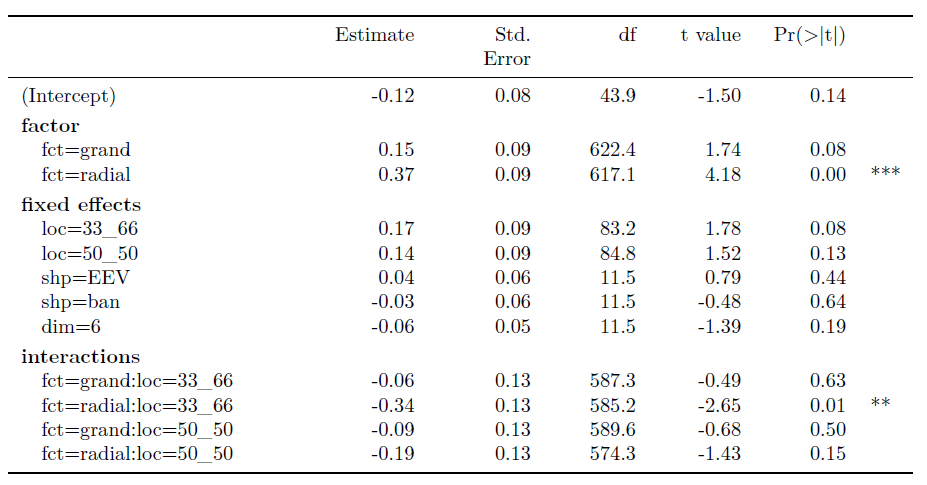

```{r include=FALSE, cache=FALSE}
library('knitr') 
knitr::opts_chunk$set(
  fig.align  = "center",
  echo       = FALSE,
  cache      = FALSE,
  cache.lazy = FALSE
)
```

<!-- # cheat sheet {#sec:cheatsheet} -->
<!-- A bib reference [@wickham_visualizing_2015]. -->
<!-- A [Section intro](#sec:cheatsheet) reference, alternatively, section ef{sec:intro} (with no @; \\ref{sec:intro}). -->
<!-- ```{r crest, echo=FALSE, out.height = "10%", out.width = "10%", fig.cap = "A caption for crest figure"} -->
<!-- knitr::include_graphics("./figures/crest.jpg") -->
<!-- ``` -->
<!-- A figure \@ref(fig:crest) reference (with @; \\@ref(fig:crest). -->
<!-- ref:myFig-cap) Separate caption created above the R chunk -->
<!-- ```{r step2, echo=F, fig.cap = "(ref:myFig-cap)"} -->
<!-- knitr::include_graphics("./figures/crest.jpg") -->
<!-- ``` -->

# Introduction {#sec:intro}
<!-- WHAT TOPICS -->

<!-- multivariate vis, tours -->
This work is concerned with linear projections of multivariate data. More specifically, we focus on the class of visualizations known as _tours_ [@cook_grand_2008, @lee_review_2021]. Tours are viewed near-continuously through small changes to the projection basis. There are many variants of tours. We focus on one of the variants, _radial tours_ [@cook_manual_1997, @spyrison_spinifex_2020]. Radial tours can be used to control or steer the projection basis, while other tour variants select bases randomly or optimize an objective function. Because of this unique attribute, _user interaction_ is another key aspect of interest in this work.


<!-- radial tour, RO#1 -->
Radial tours change the basis by selecting one variable and specifying how to change its contribution to the current projection. By controlling the contribution of a single variable, a user can explore its sensitivity to the structure of the projection and identify which variables are ultimately most important to the structure in question. In the work addressing RO#1, we improve upon the geodesic interpolator for use in the radial tour, and apply it in an open-source `R` package, `spinifex`, this package facilitates making radial tours and extends the graphics packages interoperability for itself and the tours made from the existing package `tourr`.

<!--user study, radial tour, RO#2 -->
Next, we substantiated the efficacy of radial tours as compared with user-selected, discrete combinations of principal components [@pearson_liii._1901] and continuous projections without interaction with the _grand tour_ [@asimov_grand_1985]. We conducted an $N=108$ within-participant user study, where all participants use each of these visual factors. This is performed over balanced trials across the other experimental factors: location, shape, and dimension of the data. This addresses the second research objective.

<!-- XAI, SHAP values, and RO#3 -->
In our latest work, we want to see if we can apply the radial tour to aid the interpretability of black-box models. Such models have a non-linear space making them hard to interpret or understand. One recent branch in explainable artificial intelligence [XAI, @adadi_peeking_2018, @arrieta_explainable_2020] is the use of local explanations or the attribution of the variables for one observation of a black-box model. We use such an explanation to form a 1D basis and perform radial tours to explore how the SHAP values behave differently for misclassified observations against neighboring correctly classified observations. This work corresponds to the third research objective.


# Motivation
<!-- WHY/IMPORTANCE OF THESE TOPICS -->

<!-- EDA, visuals are important, numeric summarization insufficient -->
The term exploratory data analysis (EDA) was coined by @tukey_exploratory_1977, who leaves it as an intentionally broad term that encompasses the initial summarization and visualization of a data set before a testing hypothesis has been formulated. This is a critical first step for understanding and becoming familiar with data and validating model assumptions. It may be tempting to review a series of summary statistics to check model assumptions. However, there are known datasets where the same summary statistics miss glaringly obvious visual patterns [@anscombe_graphs_1973; @matejka_same_2017]. It is easy to look at the wrong, or incomplete set of statistics needed to validate assumptions. Data visualization is crucial in EDA, it _forces_ you to see details and peculiarities of the data which are opaque to numeric summarization, or more nefariously, obscure their true values. Data visualization does and must remain a primary component of data analysis and model validation.

<!--interaction, wants citations --> studies/support -->
While static documents are the norm, there are sizable benefits of user interaction. Interactive data visualization shift the locus of control back to the user, inviting them to explore and interact with the data, and offers a compact way to explore a wider range of dimensions, questions as they arise, which helped to keep the curiosity and the interest of the user.

<!-- Black box, interprebility vs accuracy -->
With the emerging field of XAI, the constant tension between the interpretability of a model and its predictive power is receiving more attention. Linear models are the champions of interpretability with modest accuracy while increasing complex models improve accuracy but they can scarcely be interpreted even by experienced practitioners. One way to gain insight into a model is to focus on the local vicinity of one observation, and explain the variable weighting around that location, in an agnostic non-linear model. We call this observation level variable weights a _local explanation_. There are various such local explanations, many are tied to specific classes of models, while others are model-agnostic.

<!-- summary -->
We know that data visualization is important in EDA and assumption validation. User interaction allows us to explore widely and quickly while allowing us to explore ideas as they arise. These 2 elements were especially important to consider from the work addressing RO#1 as it forms a foundation to build on in further work. The efficacy of radial tours was supported by a user study in response to the second objective. In the latest work, we apply tours in tandem with local explanations to extend the interpretability of black-box models, to address RO#3.


# Research objectives
<!-- Hypothesis statement -->

The over-arching question of interest can be stated as:

**Can the radial tour with user interaction help analysts understand linear projections, and explore the sensitivity of structure in the projection to the variables contributing to the projection?**

This is further divided into these more specific objectives that we address respectively:

1. **How do we define user interaction for the radial tours to add and remove variables smoothly from a 2D linear projection of data?**\
@cook_manual_1997 described an algorithm for manually controlling a tour, to rotate a variable into and out of a 2D projection. This algorithm provides the start to human-controlled radial tours. The work [@spyrison_spinifex_2020] was adapted so that the user has more control of the interpolation. The user can set the full range of the contribution from $[-1, 1]$, and output to a device that allows the user to reproduce motions and animate or rock the rotation backward and forwards. These fine-tuned controls provide a better tool for sensitivity analysis.

2. **Do analysts understand the relationship between variables and structure in a 2D linear projection better when the radial tour is available?**\
We performed an $N=108$, within-participant user study comparing accuracy and time with the primary factor as the type of data visualization. Each participant performed 2 evaluations with either PCA (user control, but discrete), grand tour (continuous, but lack user control), or radial tour (user control and continuous animation). We find strong evidence that the radial tour increases accuracy. We also show the effects from the other experimental factors of location, shape data dimensionality, and the random effects from the data and that of the participants.

3. **Can the radial tours be used in conjunction with the local explanation, SHAP, to improve the interpretability of black-box models?**\
The tension from the trade-off between accuracy and interpretability of black-box models is rising. There is a clear need to be able to explain black-box models. We use SHAP to extract local explanations which form the projection basis to perform radial tours. We explore how misclassified observations behave relative to nearby correctly classified observations.


# Methodology
<!-- HOW YOU WILL GO ABOUT EACH PROJECT -->

The research corresponding with RO #1 entails _algorithm design_ adapting the algorithm from @cook_manual_1997. This allows for interactive control of 2D projections and serves as a foundation for the remaining work to follow.

To address RO #2, a controlled _experimental study_ has explored the efficacy of interactive radial tours as compared with 2 benchmark methods: Principal Component Analysis (PCA, @pearson_liii._1901) and the grand tour [@asimov_grand_1985]. This was a within-participant user study where each participant experienced each visual. Trials were balanced across 3 other experimental factors: location of the signal, the shape of the cluster distributions, and the dimensionality of the data.

The research for RO #3 involves _fundamental visualization design_. We know that the SAHP value is a local explanation for one observation. This SHAP value will also serve as the 1D basis for the radial tour. While using SHAP as a projection basis is novel it is not particularly insightful by itself. We provide tracking marks on the tour as well as showing the within-class distributions of the SHAP components as parallel coordinate marks on the basis. We also offer a global view and quantitative analysis evaluating the sensitivity of the SHAP-space relative to the sensitivity of the original data space.


# Work since the mid-candidature review

In the candidature confirmation review, we discussed the implementation of the radial tour with user interaction (for RO #1) which resulted in the open-source R package, `spinifex` available on CRAN and its subsequent publication [@spyrison_spinifex_2020].

At the mid-candidature review, we discussed the experimental design of the user study to substantiate the efficacy of the radial tour as compared with PCA (discrete with user interaction), and the grand tour (continuous without user interaction). Below we briefly report our findings supporting RO#2 before discussing the work addressing RO#3.


## Experimental study {#sec:expStudy}

The $N=108$ within-participant user study collected 6 trials from each participant (648 evaluations total), with 2 trials of each of visuals: PCA, grand tour, and radial tour. Three further factors: location, shape, and data dimensionality were also evenly evaluated for a comparison with the effect of controlling the visuals. Participants were crowdsourced from `prolific.co`, were selected from users that had completed an undergraduate degree, and were  compensated for their time at \pounds 7.50 per hour. Participants were tasked with identifying any and all variables contributing more than $1/p$ to the separation of clusters.

```{r studyExpFactors, echo=FALSE, out.width = "90%", out.extra = '',fig.show='hold',fig.align='center', fig.cap = "The experimental factors of the study. Visualization method is the primary factor of interest. The other factors extend the scope this problem is tested under."}
knitr::include_graphics("figures/study_exp_factors.pdf")
```

We discussed our task and measure in detail last time and in appendix A, the draft of our paper, but in summary we define accuracy as the sum of the signed square root of the signal, if selected, above or below the true cluster separation given the median:

\begin{align*}
\text{variable weight}, w_{j} &=\frac
{(\overline{X_{j, k=1}} - \overline{X_{j, k=2}})}
{\sum_{j=1}^{p}(|\overline{X_{j,k=1}} - \overline{X_{j,k=2}}|)}
- \frac{1}{p} \\
\\
\text{Accuracy}, Y &= \sum_{j=1}^{p}I(r_j) * sign(w_j) * \sqrt{|w_j|}  \\
\end{align*}


We use a mixed regression model, to regress accuracy using the factors illustrated in figure \@ref(fig:studyExpFactors) as main effects, and use the participant and data simulations as random effects. The random effects capture the variation in the accuracy due to the participant's skill and the random sampling of the data. Several models of increasing complexity were fit, and based on the model metrics we select the following model to explore the coefficient estimates of in detail.

$$
\begin{array}{ll}
&\widehat{Y} = \mu + \alpha_i * \beta_j + \gamma_k + \delta_l + \textbf{Z} + \textbf{W} + \epsilon \\
\text{where } &\mu \text{ is the intercept of the model including the mean of random effect} \\
&\textbf{Z} \sim \mathcal{N}(0,~\tau), \text{ the random effect of participant} \\
&\textbf{W} \sim \mathcal{N}(0,~\upsilon), \text{ the random effect of simulation} \\
&\epsilon   \sim \mathcal{N}(0,~\sigma), \text{ the error of the model} \\
&\alpha_i \text{, fixed term for factor}~|~i\in (\text{pca, grand, radial}) \\
&\beta_j  \text{, fixed term for location}~|~j\in (\text{0/1, 33/66, 50/50}) \text{ \% noise/signal mixing} \\
&\gamma_k \text{, fixed term for shape}~|~k\in (\text{EEE, EEV, EVV banana}) \text{ model shapes} \\
&\delta_l \text{, fixed term for dimension}~|~l\in (\text{4 variables \& 3 cluster, 6 variables \& 4 clusters}) \\
\end{array}
$$

```{r studyResults, echo=FALSE, out.width = "100%", out.extra = '',fig.show='hold',fig.align='center', fig.cap = "Summary of fitted model for accuracy. We have strong evidence supporting a relatively large increase in accuracy with the radial tour."}

```

We were surprised to see that the radial tour is the only marginal term that is significant. Not only does it enjoys the most support, but it also has the largest coefficient estimates as well. Interestingly, the single significant interaction, radial, and location = 33/66% has a large _negative_ coefficient, almost completely negating the gains from using radial when a signal and noise variable are mixed at that ratio. It is worth iterating that location, dimension, grand tour, and the intercept do have some evidence of having an effect.

A more in-depth description and discussion of this user study is attached as appendix A, a draft version of the paper, we intend to submit to the Journal of Data Science, Statistics, and Visualization. We also use the same mixed regression model to predict log response time where the grand tour has the fastest responses, presumably due to the lack of interaction.

## Extending the interpretation of black-box models with the use of interactive continuous linear projections

Local explanations describe the linear variable weights in the vicinity of an observation in $p-dim$ space. Local explanations are point-measurements of the weights for each variable describing the importance to the prediction at that point. In a highly non-linear space, the importance of the variables may change rapidly with even a small change in the explanatory variables. There are several *model-agnostic* local explanations such as LIME [@ribeiro_why_2016], and SHAP [@lundberg_unified_2017]. In practice, this application can be used with any model and compatible local explanation. However, below we apply and discuss SHAP values extracted from a random forest model.

### How a SHAP value is calculated

We use FIFA soccer data [@leone_fifa_2020] to explain SHAP values. We use 5000 player-observations of 9 aggregate skill measures to predict that player's wages. We use SHAP to observe how the skill attribution changes for different players, which should reflect different fielding positions. Fielding position is not explicitly used in the model, but we would expect that SHAP finds a way to change the variable weights across differing skill distributions to improve the accuracy of its wage predictions.

We have trained a random forest model and wish to further explore the weightings of this non-linear model. Following the work in [@biecek_dalex_2018, @biecek_explanatory_2021] we can similarly extract SHAP values, highlighting that different skills are valued differently across player positions within the model. We also show "break down" profiles, that is additive prediction explanations, how much of each player's predicted wages is added by each of the skill evaluations. Figure \@ref(fig:cheemShapBd) takes a look at the SHAP and break down profiles of a star offensive and defensive player.

```{r cheemShapBd, echo=FALSE, out.width = "100%", fig.align='center', fig.cap = "SHAP values and prediction explanations of an offensive player (Messi, top) and a defensive player (van Dijk). SHAP values show a change in weights at the location of each player. Break down profiles show one order-sensitive explanation for the prediction of that observation."}
knitr::include_graphics("figures/cheem_fifa_messi_dijk.pdf")
```

<!-- Explanation of the wage, SHAP, and breakdown profiles. -->
At the top of figure \@ref(fig:cheemShapBd) we see the relative wages of the 2 different players. SHAP uses permutations of the X variables to approximate the variable weights. In the middle, we see the distributions of the variable weightings for each player across 25 such permutations. We use the median of those distributions (large dot) as the SHAP value. We see a difference in the weights across the 2 players that makes sense considering their positions. Reaction skills are important for both players, while offensive and movement are weighted higher of the offensive player. Conversely, defensive, power, and accuracy skills are weighted higher for the defensive player. The bottom used the SHAP values to explain their relative wage predictions. We see a similar trend of the SHAP values additively explaining the difference of the global intercept to their predictions. We would expect that other offensive players have explanations closer to Messi and defensive players to lie closer to van Dijk's. The local explanations of middle fielders and goalkeepers would be expected to be different from both of these.


### Our application; Trees of Cheem

<!-- transistion to simulated data -->
Above, the FIFA data was used to regress continuous wages. In introducing this application, `Trees of Cheem`, we will be discussing the classification of simulated data. We simulation of 3 spherical clusters on the vertices of a triangle. The difference between the clusters is contained in the first 2 dimensions with no mean separation in another 2 noise dimensions. After extracting all observations' SHAP values, forming a SHAP _matrix_, of the original dimensionality, $(n~\times~p)$.

<!-- global view; pc1:2 approximation -->
We want to show a global view of the SHAP matrix and show how its sensitivity differs from that of the original data space. In figure \@ref(fig:cheemPca) we create an approximate of the data- and SHAP-spaces  with their first 2 principal components.

This gives an orientation showing where selected observation lies. We facilitate exploration and observation identification by adding a hovering tooltip displaying row number and class (actual & predicted) with linked brushing highlighting selected points and displaying their data tabularly below the plot.

```{r cheemPca, echo=FALSE, out.width = "100%", fig.align='center', fig.cap = "Data and SHAP spaces (left and right respectively) of simulated data. The points are colored and shaped according to their predicted class, misclassified points are identified with a red circle. A target observation '*' is shown in comparison 'x', containing a nearby value in data space, but quite different SHAP values. These same 2 points are tracked in the proceeding tour."}
knitr::include_graphics("figures/cheem_pca.pdf")
```

Looking at the SHAP space (right) the bulk of the correctly classified points are clustered in relatively small areas. This means that the distribution of their SHAP values is quite similar; the model is selecting a very tight variable contribution to explain the predicted class of each observation. Conversely, misclassified points tend to lie in between 2 clusters of correctly classified points. Using the interactive brushing and hover tooltips we confirm that these points lie between the actual and predicted classes.

Given the global view shown in figure \@ref(fig:cheemPca), we want to look at the local explanation of primary and comparison points (highlighted as '*/x'). In this case, the primary observation is misclassified while the comparison point is a correctly classified nearby point. These 2 points that are classified differently, but otherwise have very similar values in the explanatory variables, lie quite far apart in SHAP space.

```{r ShapDistributions, echo=FALSE, out.width = "100%", fig.align='center', fig.cap = "Top: 1D projection basis, the normalized SHAP values of the select observation are shown as grey/black bars. The distribution of the other observations is shown with parallel coordinate lines. The primary and comparison points ('*/x' previous) are shown as bolder dashed lines and fainter dotted lines respectively. Bottom: the 1D density and rug marks of the current projection basis."}
knitr::include_graphics("figures/cheem_radialtour_initial.pdf")
```

Now we have the global context and a comparison of the sensitivity of the SHAP spaces let's turn more toward the target observations. Figure \@ref(fig:ShapDistributions) highlights the same selected points, bolder dashed and fainter dotted lines (previously '*/x' points respectively). The top of the figure shows the selected observation's SHAP values as grey/black bars. The other values of the SHAP matrix are displayed as short vertical bars and joining parallel coordinate lines and are similarly colored with their predicted class. The majority of the easy-to-classify points form a relatively tight spread in the first 2 variables (signal) and more chaotic behavior in the two noise variables as we would expect. Our dotted comparison lies with the bulk of the purple class. The dashed primary point is actually a green point misclassified as a purple, its weight for V1 looks like a green point, but its V2 weight deviates and is much closer to that of a purple. V2 is the variable taht is crucial to the explanation of the model for why this particular point is misclassified. In the absence of V2, our target observation is weighted much closer to the that of its true class. This is the variable we want to explore the structure of in the radial tour as indicated with the black contribution bar.

```{r cheemTour, echo=FALSE, out.width = "100%", fig.align='center', fig.cap = "The first frame of the radial tour. The SHAP values of the selected observation set the initial basis, shown as the grey and black bars on top. Within class distributions of the SHAP values are shown as parallel coordinate plots next to the variable contributions. The class densities and observation positions of the 1D projection are shown on the bottom. The tour animates over small changes in the basis (top bars) as the variable with the largest contribution (weight) is rotated to have a full contribution, zero contribution, and then back to the initial contribution. Variable 2 is critical to this local explanation; In the initial contribution, both selected observations are in the middle of the purple. With a full contribution of V2 typical of most purple, our primary observation is toward the tail. When there is no contribution of variable 2, the selected observation is in the middle of the green distribution, its true class."}
knitr::include_graphics("figures/cheem_radialtour_endpts.pdf")
```

Now that we have identified that V2 is the variable that deviated most from its true peer observation, we select it to rotate with the radial tour. In figure \@ref(fig:cheemTour) illustrates the difference in the extremes of the contribution. The tour starts at the original contributions as described by the SHAP values (left frame). As the tour gives V2 a full contribution (middle frame) the comparison lies in the middle of the purples while the target observation is in the tails of both the purple and green (true class). In the right-most frame, the contribution from variable 2 is zero and the target variable lies in the middle of its true class. That is to say, without the contribution of variable 2 the local explanation does not seem reasonable; the selected observation looks much more like that of its true class.

This application is still maturing and has mostly focused on classification tasks. We have partial implementation of regression which will be demonstrated in the presentation, time permitting. This work is being written up to be submitted to the WHY-21 workshop, part of the NeurIPS 2021 Conference.

### Discussion

We have used radial tours to improve the interpretability of black-box models. We display 2D approximations of the data to keep the global context in mind and facilitate the selection of points to focus on. After a target point have been identified, its SHAP values are used as the initial projection basis. Where the within-class distributions of the value values are displayed. The default variable selected contains the largest difference from the median of SHAP values within that point's actual classification. That is that variable that deviates the most from what would be expected from a typical correctly classified observation.

Taking a step back, it is important to remember that this visualization and analysis is sensitive to the model and local explanation; it describes them as they are, independent of their validity and quality. The insight gleaned by this is predicated on meaningful selection of model and explanation.

Turning for a minute to real-world application, developing methods to better interpret black-box models is an important and impactful challenge. Private corporations and nation-states increasingly using complex models to classify and predict their customers and citizens from loans and insurance claims to employment and credit scores, the real-world impact of highly non-linear is here to stay. Being able to see the specifics of one observation may seem small in the context of a model, but it is crucial to that instance; if misclassificated, that  observation may receive an outcome a world apart from its actual peers.


# Proposed thesis structure & program requirement
<!-- For thesis structure see: https://thesisgeek.com/blog/thesis-structure/ -->

This is my assessment of the completion of the thesis research thus far:

- Introduction -- 60%
- Literature review -- 80%
- (RO #1) GI \& radial tours -- 90%
- (RO #2) radial tour efficacy user study -- 80%
- (RO #3) radial tour & local explanations -- 70%
- Discussion -- 50%
<!-- Explain to the audience what your results mean for the scientific community. -->
<!-- Comment on each of the results and discuss how your findings support your thesis. -->
<!-- Explain any unexpected results so the evaluation committee can see that you know what you’re doing. -->
<!-- Interpret the results and tie them with other research on the subject. How does your research help the academic community? -->
- Conclusion -- 30%
<!-- show your readers that you have achieved your research objectives. You can talk a bit about what you’ve learned in the process and even make some suggestions regarding the need for future research. In most cases, students also reiterate the thesis statement at the beginning of the conclusion, followed by a short summary of the paper’s most important chapters. -->

The other requirements for this program are complete.

Figure \@ref(fig:timeline) illustrates the purposed timeline for this research.

```{r timeline, echo=FALSE, out.width = "100%", out.extra = '', fig.cap = "Proposed research timeline."}
knitr::include_graphics("figures/timeline_post_presubmission.png")
```

## Adverse conditions

In addition to the ongoing COVID-19 pandemic, I faced major rework in the second project to accommodate physical distancing. Namely, the user study that was all but ready to be run in person, had to be restructured, to better suit crowdsourcing online. The experimental factors had to be simplified for less knowledgeable people with no interactive help or direction. The shiny apps that hosted the application were not suitably resourced to handle the volume of the crowdsourcing which further exasperated the situation.

Regular circumstances were also obstructed as I took 2 intermissions out of concern for my mental health, namely anxiety and depression, stemming from my obsessive-compulsive personality disorder.

Intermission periods:

- 13/03/2020 - 08/05/2020
- 15/11/2020 - 01/10/2021

# Other Contributions

- “Is IEEE VIS *that* good?”, AltVis [@spyrison_is_2021]
- Student Volunteer, UseR!2021 Online
- A Review of the State-of-the-Art on tours Dynamic Visualization of High-dimensional Data [@lee_advanced_2021]
- 1st place in 2020 Melbourne Data Marathon [@barrow_melbourne_2020] <!-- Oct? 2020 -->
- Statistics Ph.D. reading group, Introduction to linear & nonlinear dimension reduction, discussing: "Dimensionality Reduction: A Comparative
Review. van der Maaten" 2020 <!-- August 2020 -->
- Student Volunteer, CHI Down Under 2020, Online
- NUMBAT Workshop, Animating ggplot2 figures with gganimate, 2018 <!-- Oct 2018 --> 
- Student Volunteer, UseR!2018, Brisbane, Australia

# Acknowledgements {#sec:acknowledgements}

I would like to thank Professor Przemyslaw Biecek for his time and input in suggesting to look at SHAP local explanations and try applying to the FIFA dataset.

This research was supported by an Australian government Research Training Program (RTP) scholarship. This article was created in `R` [@r_core_team_r:_2020] and `rmarkdown` [@xie_r_2018].

For transparency and reproducibility, the source files are made available at [github.com/nspyrison/phd_milestones](https://github.com/nspyrison/phd_milestones).


# References
