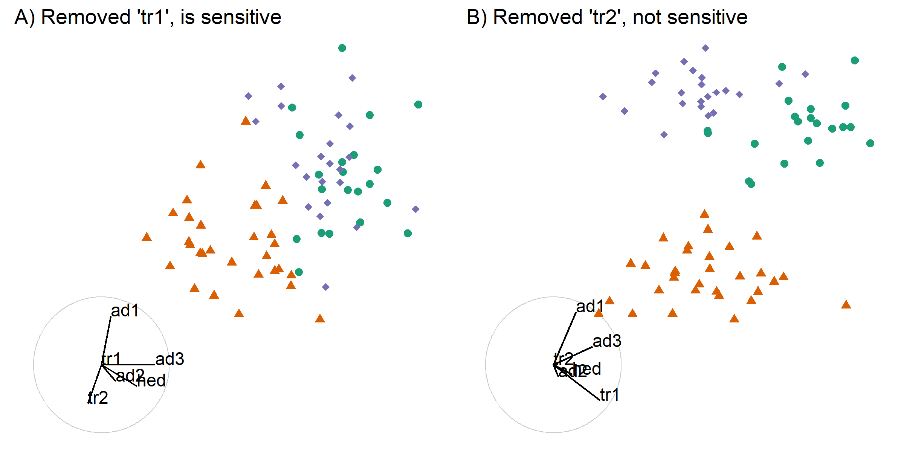
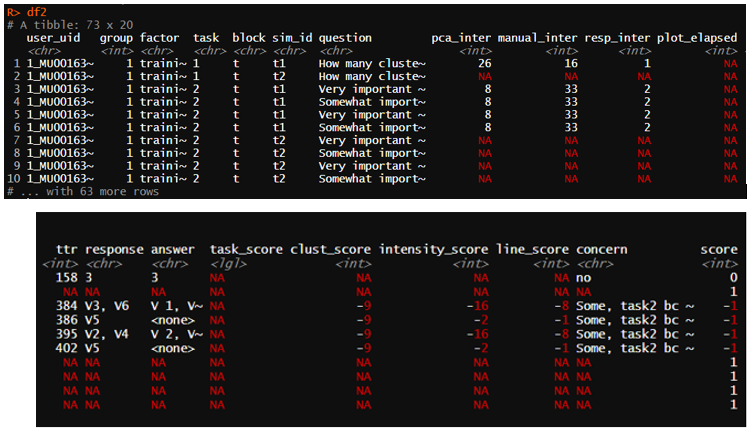

```{r setup_pres, include = FALSE}
knitr::opts_chunk$set(
  eval      = TRUE,  # R code 
  echo      = FALSE, # code text
  include   = TRUE,  # plots
  results   = 'asis', # text 'markup' 'asis' 'hold' 'hide'
  message   = F, warning = F, error = F, cache = F, cache.lazy = F,
  fig.align = "center",
  collapse  = TRUE
)

library(magrittr)
library(knitr)
library(kableExtra)
```

## Motivation

- *Exploratory data analysis (EDA)* is important and ubiquitous
- 2D EDA: visualization is more robust and thorough than statistical summarization alone
- Visualization of high dimension space, $p > 3$ is non-trivial
- _Need more options in the analysts' toolbelt to explore high-dimension spaces!_

```{r, echo = F, out.width = '75%'}
knitr::include_graphics("./slide_figures/AllDinosAnimatedSmaller.gif")
```
Datasaurus dozen; same means, standard deviations, and correlations *(Matejka & Fitzmaurice, 2017)*

---

## Scope of data

__Multivariate tabular,__ $n$ observations of $p$ attributes
- Can be feature- or parameter- decomposition of non-standard formats

```{r, echo = F, out.width = '90%'}
knitr::include_graphics("./slide_figures/tmunzner_vad16.png")
```
*(Munzner, 2014)*

---

## Linear projections

- Simple dimension reduction, highlight interesting features
- Analytical procedures:
    - Principal component analysis (PCA)
    - Linear discriminant analysis
    - Multiple regression
- Visual procedures:
    - *Tour*, animation of many frames that are close
    - Types: grand, guided, little, local, manual (most available in `tourr` R package)
    - Method to control the contribution of a single variable *(Cook & Buja, 1997)*

**Shadow analogy:**
```{r, echo = F, out.width = '65%'}
knitr::include_graphics("./slide_figures/shadow_puppet.png")
```

---

## Basis

Linear projections are specified by their basis.
- Each column is a linear combinations the original variables 
- _Orthonormal_: all columns at right angles and of length 1

```{r, echo = F, out.width = '82%'}
knitr::include_graphics("./slide_figures/basis.png")
```

---

## Geodesic interpolation (GI)

Selection of intermediate bases along the shortest path of orthonormal bases.

- Used in other tour methods including the grand tour _(Asimov, 1985)_

```{r, echo = F, out.width = '62%'}
knitr::include_graphics("./slide_figures/buja05fig.png")
```
_(Buja et al., 2005)_

---

## Sensitivity of structure in a projection

- Some variables are more sensitive to the structure within a projection
- Illustrated by controling variable contributions:

```{r, echo = F, out.width = '87%'}

```

---

## Research objectives

__Can user-guided geodesic interpolation help analysts understand linear projections of data and explore the sensitivity of structure in the projection to the variables contributing to the projection?__
<br>

- 1) How do we define user interaction for a geodesic interpolator to add and remove variables smoothly from a 2D linear projection of data? 
    - _Algorithm design_ adapt and apply manual interaction (interactive 2D GI)
- 2) Do analysts understand the relationship between variables and structure in a 2D linear projection better when the interactive geodesic interpolator is available? 
    - _Experimental study_ comparing the efficacy of 2D GI (2D GI usability study)
- 3) Can we define a geodesic interpolator for 3D projections so that the technology can be implemented in modern virtual reality environments? 
    - _Algorithm design_ extend and apply theory to 3D (interactive 3D GI)
- 4) Does geodesic interpolation in 3D provide advantages over 2D for understanding structure in linear projections? (3D GI usability study)
    - _Experimental study_ comparing the efficacy of 3D GI (3D GI usability study)

---

## Progress since confirmation -- interactive 2D GI (RO #1)

.large[
Paper: 
- R Journal (_accepted_, to be published in next issue)
- Adaptation:
    - Define the axes of rotation
    - Proof for the rotation matrix with the application of Rodrigues' formula *(Rodrigues, 1840)*
    - Initialization of angle parameters to clarify the understanding and implementation
- Application to particle physics data
- Appendix A of the milestone document

Software: `spinifex` R package, available on [CRAN](https://cran.r-project.org/web/packages/spinifex/index.html)
]

---

## Work in progress -- 2D GI usability study (RO #2)

.large[.large[ 
Experimental study:
- Hypothesis: _Does the finer control afforded by GI improve the ability of the analyst to understand the importance of variables contributing to the structure?_
- Factors: principal component analysis, grand tour (grand), and 2D GI
- Within-participant study; all participants will perform all factors
- Implemented via `shiny` application
- Draft of paper included as appendix B of the milestone document
]]

---

## Work in progress -- design

```{r, echo = F, out.width = '100%'}
knitr::include_graphics("./slide_figures/experimental_design_personA.png")
```

---

## Work in progress -- introduction & training

```{r, echo = F, out.width = '100%'}
knitr::include_graphics("./slide_figures/appTraining1.png")
```

---

## Work in progress -- task training

```{r, echo = F, out.width = '100%'}
knitr::include_graphics("./slide_figures/appTraining2.png")
```

---

## Work in progress -- evaluation interface, PCA

```{r, echo = F, out.width = '78%'}
knitr::include_graphics("./slide_figures/appPca.png")
```

---

## Work in progress -- evaluation interface, GI


```{r, echo = F, out.width = '94%'}
knitr::include_graphics("./slide_figures/appManual.png")
```

---

## Work in progress -- evaluation interface, grand

```{r, echo = F, out.width = '86%'}
knitr::include_graphics("./slide_figures/appGrand.png")
```

---

## Work in progress -- follow up survey

```{r, echo = F, out.width = '100%', out.height = '100%'}
knitr::include_graphics("./slide_figures/appSurvey.png")
```

---

## Measures and response -- 2D GI usability study

- Logfile capturing every action
- During evaluation:
    - Response, time, number, and type of interaction

```{r, echo = F, out.width = '75%'}

```

---

## Thesis drafting

.large[.large[
This is my assessment of the completion of the thesis drafting thus far:

- Introduction – 60%
- Literature review – 80%
- (RO #1) 2D GI – 90%
- (RO #2) 2D GI Experimental study – 40%
- (RO #3) 3D GI – 0%
- (RO #4) 3D GI Experimental study – 0%
- Conclusion and future plans – 0%
]]

---

## Research timeline

```{r timeline, echo = F, out.width = '92%'}
knitr::include_graphics("./slide_figures/phd_timeline.png")
```

---

## Future work -- Interactive 3D GI (RO #3)

.large[.large[
2D GI rotates a 2D basis in a 3D manipulation space with 2 angle parameters.

Analogously, 3D GI rotates a 3D basis in a 4D manipulation space with 3 angle parameters.

- Define the 3 axes of rotation
- Solve for the rotation matrix by application of Rodrigues' formula
- Attention to sign changes (4D and trig functions supporting half a rotation)
]]

---

## Future work -- 3D GI usability study (RO #4)

.large[
Option 1: implement using `shinyaframe` and append to the `shiny` application addressing RO #2
- Pro: faster implementation and reuse of previous implementation
- Con: unknown extent and extendibility of user interaction
- Proof of concept; _Hadjar et al. (2018)_ user interaction changing axes on a 3D scatterplot 

Option 2: implement in `Unity` and implement a new application for experimental study
- Pro: unimpeded extendibility of user interaction 
- Con: slower implementation and slower and rework implementation
]

---
class: center, middle

.large[
## Thanks

To Di and Kim for their suggestions and guidance.
<br><br>

## Acknowledgments

Slides created in R using rmarkdown and xaringan *(R Core Team, 2019; Xie et al. 2018; Xie, 2018)*

Slides available -- [github.com/nspyrison/mid_candidature/_slides](https://github.com/nspyrison/mid_candidature/_slides)
<br><br>

### Questions?
]

---

## Appendix -- Program requirements

WES Academic record
- FIT 5144: 2019 S1+2, __In progress__, extended to the pre-submission seminar with the unit
coordinator for the usual 2 year duration
    - Hours: 147 of 120 hours _Tracked_, missing the following requirements (12 hr total)
        - __Needed__: CYR 2 (A & B) – 2x 3hr
        - __Needed__: Faculty of IT Workshop 1 and 3 on Ethical Research and Publishing – 2x 3hr
- FIT 5113: 2018 S2, `exemption`
- FIT 6021: 2018 S2, `completed with distinction`
-myDevelopment - IT: Monash Doctoral Program - compulsory modules
    - Monash graduate research student induction: `completed`
    - Research integrity - Choose the Option most relevant: `completed`
    - Faculty induction: `completed`
