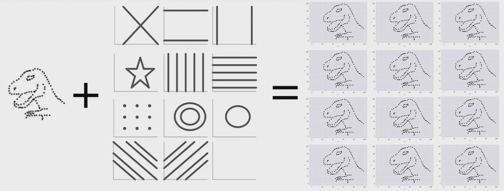
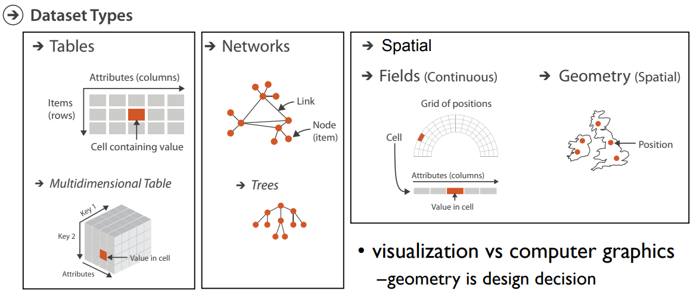
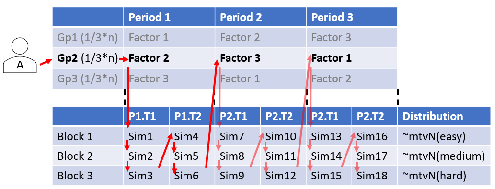
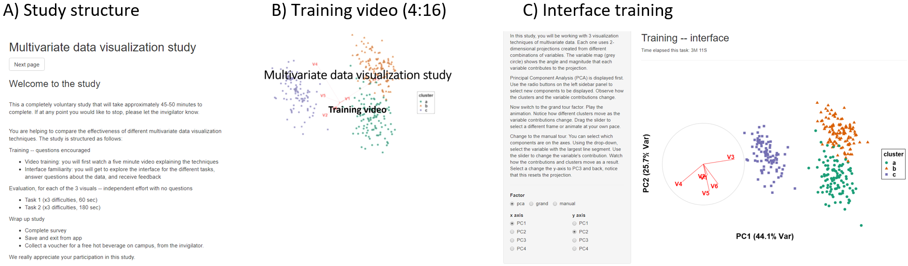
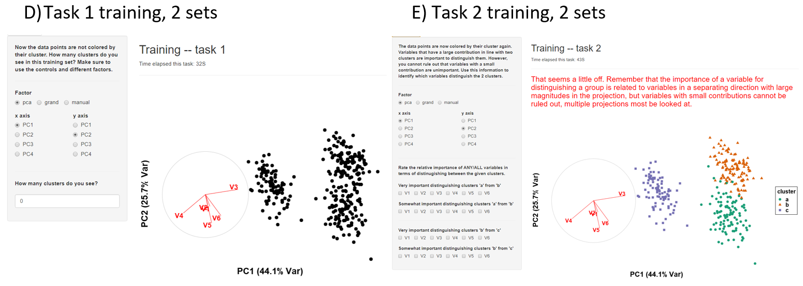
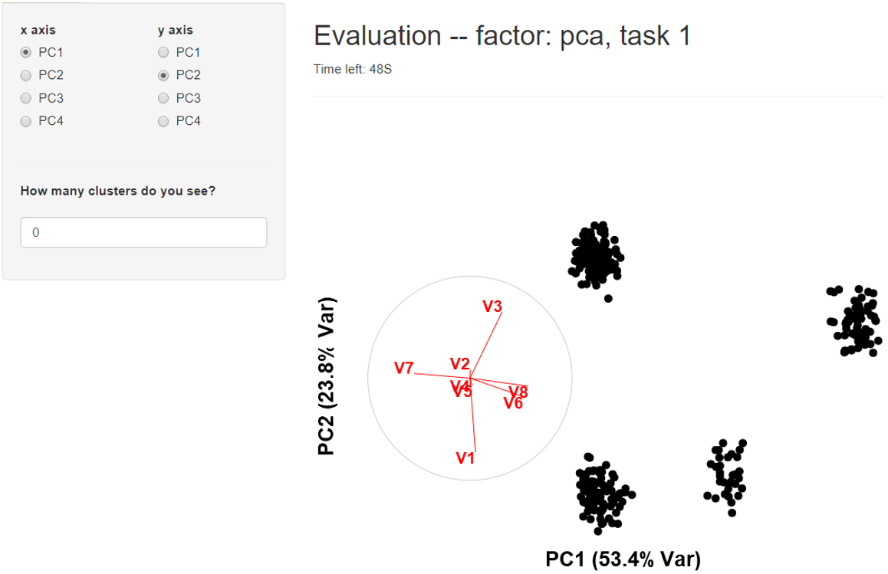
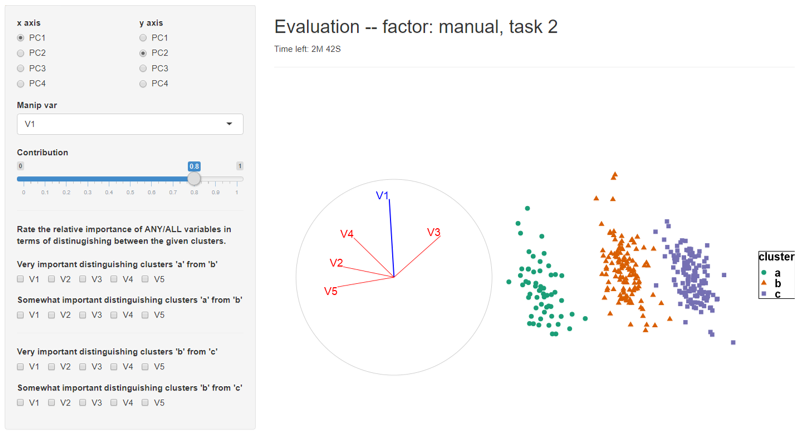
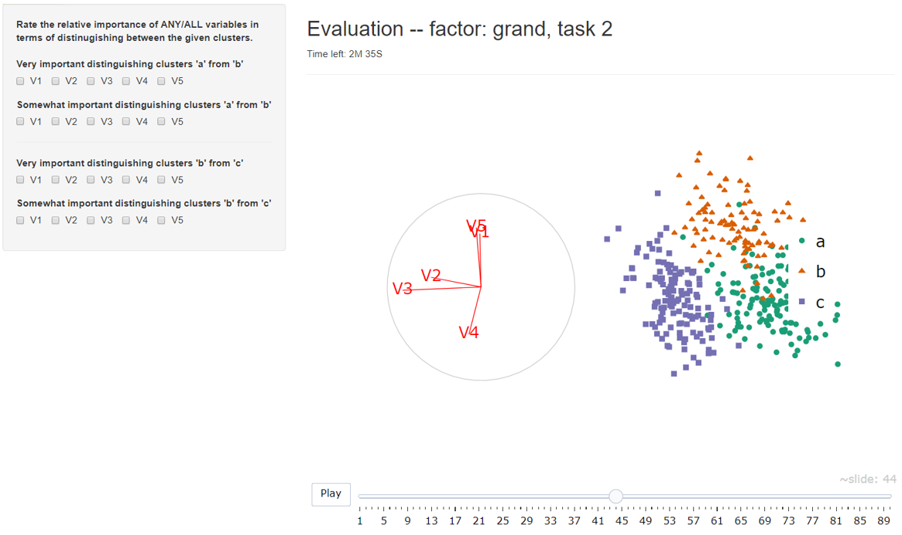
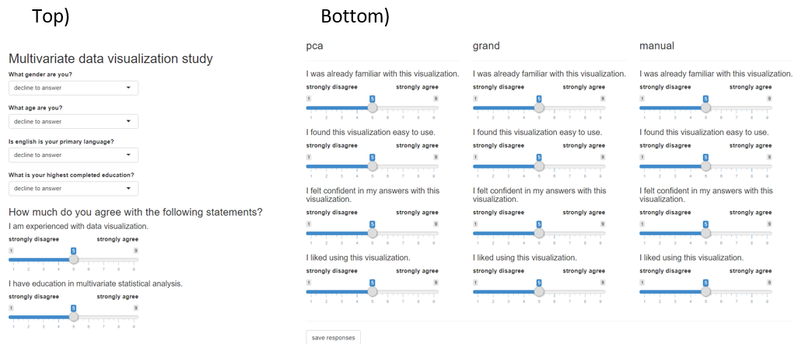
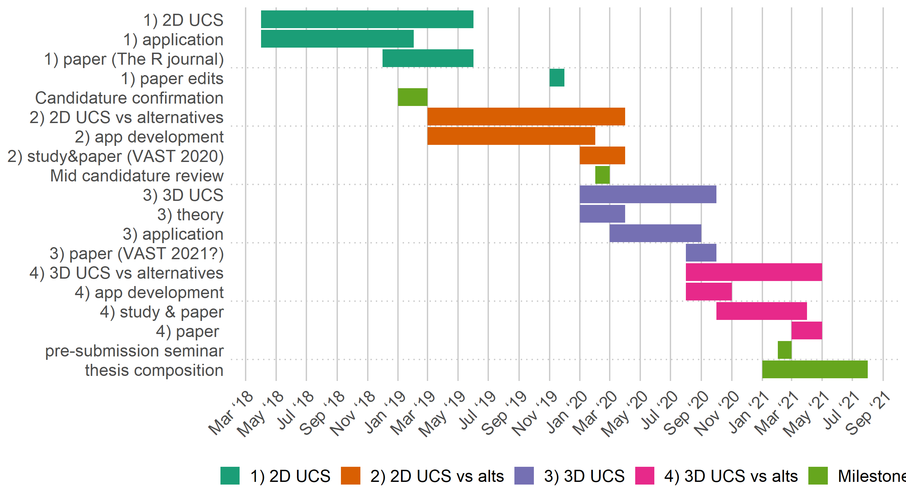

```{r setup_pres, include = FALSE}
knitr::opts_chunk$set(
  eval      = TRUE,  # R code 
  echo      = FALSE, # code text
  include   = TRUE,  # plots
  results   = 'asis', # text 'markup' 'asis' 'hold' 'hide'
  message   = F, warning = F, error = F, cache = F, cache.lazy = F,
  fig.align = "center",
  collapse  = TRUE
)

library(magrittr)
library(knitr)
library(kableExtra)
```

## Motivation

- *Exploratory data analysis (EDA)* is important and ubiquitous
- 2D EDA: visualization is more robust and thorough than statistical summarization alone
- Visualization of high dimension space, $p > 3$ is non-trivial
- We need more options in the analysts' toolbelt

```{r, echo = F, out.width = '80%', out.height = '80%'}

```

Datasaurus dozen; same means, standard deviations, and correlations, *(Matejka & Fitzmaurice, 2017)*


---

## Visualizing multivariate spaces

Visualization of high dimension space, $p > 3$ is non-trivial:
- Reduce dimension with model or feature production, _parameter space_
- Linear projection of data through an _orthogonal basis_
    - Vectors are at right angles
    - Length of each vector is 1
- Non-linear projection of data
    - _not interoperable_ back to variable space

**Linear projection, shadow analogy:**

```{r, echo = F, out.height = '70%', out.width = '70%'}
knitr::include_graphics("./slide_figures/shadow_puppet.png")
```


---

## Scope of data

```{r, echo = F, out.width = '90%'}

```
*(Munzner, 2014)*

__Multivariate tabular__
    
- Can be feature- or parameter- decomposition of non-standard formats


---

## Linear projections

- Simple dimension reduction technique that can highlight interesting features
- Analytical procedures using linear projections:
    - Principal component analysis (PCA)
    - Linear discriminant analysis
    - Multiple regression
- Visual procedures utilizing linear projection:
    - *Tour*, animation of many frames or relatively small changes to the basis
    - Types of tours: grand, guided, little, local, manual (most available in `tourr` R package)
    - *(Cook & Buja, 1997)* provide a method to control the contribution of a single variable in a projection

<br><br>
__This leads to the overarching research objective.__


---

## Basis, Geodesic interpolation,  structural sensitivity

<!-- TODO: GI Definition here -->


- GI ...

---

## Research objectives

__Can geodesic interpolator with user interaction help analysts understand linear projections of data, and explore the sensitivity of structure in the projection to the variables contributing to the projection?__
<br>

- 1) How do we define user interaction for a geodesic interpolator to add and remove variables smoothly from a 2D linear projection of data? 
    - _Algorithm design_ adapt and apply manual interaction (interactive 2D GI)
    
- 2) Do analysts understand the relationship between variables and structure in a 2D linear projection better when the geodesic interpolator is available? 
    - _Experimental study_ comparing the efficacy of 2D GI (2D GI structure study)
    
- 3) Can we define a geodesic interpolator for 3D projections so that the technology can be implemented in modern virtual reality environments? 
    - _Algorithm design_ extend and apply theory to 3D (interactive 3D GI)
    
- 4) Does 3D provide advantages over 2D for understanding structure in high-dimensional data when exploring projections from a geodesic interpolator? (3D GI structure study)
    - _Experimental study_ comparing the efficacy of 3D GI (3D GI structure study)

---

## Progress since confirmation -- Interactive 2D GI (RO #1)


Paper: 
- R Journal (accepted, to be published in next issue)
- Adaptation:
    - Define the axes of rotation
    - Prove the rotation matrix with the application of Rodrigues' formula *(Rodrigues, 1840)*
    - Include initialization of angles, (in- and out- of projection plane), and clarify for application
- Application to particle physics data
- Appendix A of the milestone document

Software: `spinifex` R package, available on [CRAN](https://cran.r-project.org/web/packages/spinifex/index.html)

---

## Work in progress -- 2D GI usability study (RO #2)

Experimental study:
- Hypothesis: _Does the finer control afforded by the manual tour improve the ability of the analyst to understand the importance of variables contributing to the structure?_
- Factors: principal component analysis, grand tour (grand), and 2D GI
- Within-participant study; all participants will perform all factors
- Implemented via `shiny` application
- Draft of paper included as appendix B of the milestone document

_Designed, ethics approval, currently being piloted_

---

## Work in progress -- design

_2D GI usability study (RO #2)_

```{r, echo = F, out.width = '100%'}

```

---
## Work in progress -- introduction, video, interface training

_2D GI usability study (RO #2)_

```{r, echo = F, out.width = '100%'}

```

---

## Work in progress -- task training

_2D GI usability study (RO #2)_

```{r, echo = F, out.width = '100%'}

```

---

## Work in progress -- evaluation interface, PCA

<!-- _2D GI usability study (RO #2)_ -->

```{r, echo = F, out.width = '70%'}

```

---

## Work in progress -- evaluation interface, GI

<!-- _2D GI usability study (RO #2)_ -->

```{r, echo = F, out.width = '90%'}

```

---

## Work in progress -- evaluation interface, grand

<!-- _2D GI usability study (RO #2)_ -->

```{r, echo = F, out.width = '80%'}

```

---

## Work in progress -- follow up survey

<!-- _2D GI usability study (RO #2)_ -->

```{r, echo = F, out.width = '100%', out.height = '100%'}

```

---

## Measures and response -- 2D GI usability study

- Logfile capturing every action
- During evaluation:
    - Response, time, number and type of interaction
- Post evaluation survey:
    - Demographics: age, sex, education, English primary language, visualization, and multivariate familiarity
    - By factor, 9-point Likert-type scale: familiarity, ease, confidence, and likability
    
<!-- TODO: Include ans_tbl structure here? -->

---

## Thesis drafting

This is my assessment of the completion of the thesis drafting thus far:

- Introduction – 60%
- Literature review – 80%
- (RO #1) 2D GI – 90%
- (RO #2) 2D GI Experimental study – 40%
- (RO #3) 3D GI – 0%
- (RO #4) 3D GI Experimental study – 0%
- Conclusion and future plans – 0%

---

## Research timeline

```{r timeline, echo = F, out.width = '90%'}

```

---

## Future work -- RO #3

_Interactive 3D GI_

2D GI rotates a 2D basis in a 3D manipulation space about an in-plane angle and an out-of-plane angle.

Analogously, 3D GI rotates a 3D basis in a 4D manipulation space about 2 in-"plane" angles and an out-plane angle.

- Define the 3 axes of rotation
- Solve for the rotation matrix by application of Rodrigues' formula

---

## Future work -- RO #4

_3D GI usability study_

Option 1: implement using `shinyaframe` and append to the `shiny` application addressing RO #2
- Pro: faster implementation and reuse of previous experimental study application
- Con: unknown extent and extendibility of user interaction
- Proof of concept; _Hadjar et al. (2018)_ user interaction changing axes on a 3D scatterplot 

Option 2: implement in `Unity` and implement a new application for experimental study
- Pro: unimpeded extendibility of user interaction 
- Con: slower implementation and slower and more rework of application

<br><br>
Option 1 seems preferable at the moment

---
class: center, middle

## Thanks

Di and Kim for their suggestions and guidance.
<br><br>

## Acknowledgments

Slides created in R using rmarkdown and xaringan *(R Core Team, 2019; Xie et al. 2018; Xie, 2018)*

Slides available -- [github.com/nspyrison/mid_candidature/_slides](https://github.com/nspyrison/mid_candidature/_slides)
<br><br>

### Questions?

---

## Appendix -- Program requirements

WES Academic record
– FIT 5144: 2019 S1+2, _In progress_, extended to the pre-submission seminar with the unit
coordinator for the usual 2 opportunities to complete
    - Hours: 147>120 hours _Tracked_, missing the following requirements (12 hr total)
        - __Needed__: CYR 2 (A & B) – 2x 3hr
        - __Needed__: Faculty of IT Workshop 1 and 3 on Ethical Research and Publishing – 2x 3hr
- FIT 5113: 2018 S2, __exemption__
- FIT 6021: 2018 S2, __completed with distinction__
-myDevelopment - IT: Monash Doctoral Program - compulsory modules
    - Monash graduate research student induction: __completed__
    - Research integrity - Choose the Option most relevant: __completed__
    - Faculty induction: __completed__
