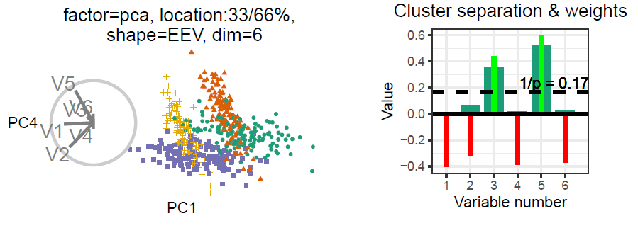

```{r setup, include = FALSE}
knitr::opts_chunk$set(
  eval      = TRUE,   # R code
  echo      = FALSE,  # code text
  include   = TRUE,   # plots
  results   = 'asis', # text 'markup' 'asis' 'hold' 'hide'
  fig.align = "center",
  collapse  = TRUE,
  message   = F, warning = F, error = F,
  cache     = F, cache.lazy = F
)
require("knitr")
require("kableExtra")
require("magrittr")


### half-working title slide; c+p outside of chunk ###
# background-size: cover
# class: title-slide
# count: false
# <!-- Half working custom title slide -->
# 
# # .monash-blue[`r rmarkdown::metadata$title`]
# 
# <br>
# <h2 style="font-weight:900!important;">`r rmarkdown::metadata$subtitle`</h2>
# .bottom_abs.width100[
# Presenter: *`r rmarkdown::metadata$author`*
# <i class="fas fa-university"></i> `r rmarkdown::metadata$department`, <Br>&nbsp;&nbsp;&nbsp;&nbsp;&nbsp;Monash University, Melbourne, Australia
# <i class="fas fa-envelope"></i>  `r rmarkdown::metadata$email`
# <a href="https://twitter.com/statsgen" style="color:black"><i class="fab fa-twitter"></i> @statsgen</a>
# <i class="fas fa-calendar-alt"></i> `r rmarkdown::metadata$date`
# <br>
# ]
```

## Outline

.pull-left[
- Introduction
- Motivation
- Research objectives & methodology
- Refresher: linear projections

**RO#2 Radial tour user study:**
- Factors
- Task
- Model
- Results
]

.pull-right[
**RO#3, Radial tour and local explanations:**
- Local explanations
- SHAP values

**Our application:**
- Global view
- 1D basis distributions
- Radial tour
- Demo application
- Conclusion
- Thesis progress
]


---

## Introduction

- Multivariate data visualization
- Data visualization _tour_; continuous linear projection over small changes in the projection basis
- _radial tour_ (RO#1); given a basis, variable and direction to change using geodesic interpolator, to change it's contribution
- Efficacy of the radial tour (RO#2); $n=108$ within-participant user study against the alternatives PCA and grand tour
- Improving the interpretability of black-box models using the radial tour (RO#3)

---

## Motivation

- _Exploratory data analysis_ is important for understanding the data and testing the validity of assumptions
- Data visualization is more robust and thorough than statistical summarization alone
- Tours are one way to extend our ability to visualize data space as dimensions increase
- Exploratory Artificial Intellegence (XAI), growing tension of accuracy and interpretability of black-box models.

---

## Linear projections & orthonormal basis

```{r, echo = F, out.width = '100%'}
knitr::include_graphics("./slide_figures/linear_proj.png")
```

---

## Research objectives & methology

__Can the manual tour help analysts understand linear projections and explore the sensitivity of structure in the projection to the variables contributing to the projection?__
<br>

- 1) Define user interaction for the manual tour to add and remove variables from a 2D linear projection
    - *Algorithm design*, develop and apply user interaction; R package `{spinifex}` _Spyrison, et al, 2019_
- 2) Do analysts better understand the relationship between variables and structure in a 2D linear projection better when the interactive manual tour is available?
    - *Experimental study*, $n=108$ within participant user study comparing radial tours with PCA, and the grand tour.
    - briefly get into the model and results
- 3) Can the geodesic interpolator be used in conjunction with the local explanation, SHAP, to improve the interpretability of black-box models?
    - *fundamental visualization design*, how can we use the radial tour to explore the structure identified in local explanations of a black-box model

---
class: inverse, center, middle

# RO#2, User study

<!-- - $n=108$ with-in participant -->
<!-- - Crowdsourced with prolific.co -->

---

## Experimental factors

```{r echo = F, out.width = '100%'}
knitr::include_graphics("./slide_figures/study_exp_factors.pdf")
```

---

## Task

```{r echo = F, out.width = '100%'}

```

---

## Model

\begin{array}{ll}
&\widehat{Y} = \mu + \alpha_i * \beta_j + \gamma_k + \delta_l + \textbf{Z} + \textbf{W} + \epsilon \newline
\text{where } &\mu \text{ is the intercept of the model including the means of random effects} \newline
&\textbf{Z} \sim \mathcal{N}(0,~\tau), \text{ the random effect of participant} \newline
&\textbf{W} \sim \mathcal{N}(0,~\upsilon), \text{ the random effect of simulation} \newline
&\epsilon   \sim \mathcal{N}(0,~\sigma), \text{ the error of the model} \newline
&\alpha_i \text{, fixed term for factor}~|~i\in (\text{pca, grand, radial}) \newline
&\beta_j  \text{, fixed term for location}~|~j\in (\text{0/1, 33/66, 50/50}) \text{ % noise/signal mixing} \newline
&\gamma_k \text{, fixed term for shape}~|~k\in (\text{EEE, EEV, EVV banana}) \text{ model shapes} \newline
&\delta_l \text{, fixed term for dimension}~|~l\in (\text{4 variables & 3 cluster, 6 variables & 4 clusters})
\end{array}

---

## Results

```{r echo = F, out.width = '100%'}
knitr::include_graphics("./slide_figures/spinifex_study_y1_results.PNG")
```

---
class: inverse, center, middle

# RO#3, Radial tour and local explanations

---

## Local explanations

- Point-measurement, the variable weights of the importance to the model
- Applied 1 observation, given a model

```{r echo = F, out.width = '60%'}
knitr::include_graphics("./slide_figures/lime_nonlinear.png")
```
Ribeiro, M. et. al. (2017). Why Should I Trust You?

---

## SHAP values

- We apply use the model-agnostic explanation, SHAP, to random forest models.
- Approximates importance to the model with the median importance, permuting over combinations of the explanatory variables

```{r echo = F, out.width = '100%'}
knitr::include_graphics("./slide_figures/cheem_fifa_messi_dijk.pdf")
```

---
class: inverse, center, middle

# Our application, Trees of Cheem

---

## Global View

```{r echo = F, out.width = '100%'}
knitr::include_graphics("./slide_figures/cheem_pca.pdf", TRUE)
```

---

## 1D basis distribution

```{r echo = F, out.width = '100%'}
knitr::include_graphics("./slide_figures/cheem_pca.pdf")
```

---

## Radial tour

```{r echo = F, out.width = '100%'}
knitr::include_graphics("./slide_figures/cheem_pca.pdf")
```

---

## Demonstration

???

run Trees of Cheem app, or app function if working package structure

---

## Conculsion

---

## Thesis progress

.large[.large[
- Introduction – 60%
- Literature review – 80%
- (RO #1) 2D GI – 90%
- (RO #2) 2D GI Experimental study – 40%
- (RO #3) 3D GI – 0%
- (RO #4) 3D GI Experimental study – 0%
- Conclusion and future plans – 0%
]]

---

## Research timeline

```{r, echo = F, out.width = '92%'}
knitr::include_graphics("./slide_figures/phd_timeline.png")
```

---

## Future work -- Interactive 3D GI (RO #3)

.large[.large[
2D GI rotates a 2D basis in a 3D manipulation space with 2 angle parameters.

Analogously, 3D GI rotates a 3D basis in a 4D manipulation space with 3 angle parameters.

- Define the 3 axes of rotation
- Solve for the rotation matrix by application of Rodrigues' formula
- Attention to sign changes (4D and trig functions supporting half a rotation)
]]

---

## Future work -- 3D GI usability study (RO #4)

.large[
Option 1: implement using `shinyaframe` and append to the `shiny` application addressing RO #2
- Pro: faster implementation and reuse of previous implementation
- Con: unknown extent and extendibility of user interaction
- Proof of concept; _Hadjar et al. (2018)_ user interaction changing axes on a 3D scatterplot 

Option 2: implement in `Unity` and implement a new application for experimental study
- Pro: unimpeded extendibility of user interaction 
- Con: slower implementation and slower and rework implementation
]

---
class: center, middle

.large[
## Thanks

To Di and Kim for their suggestions and guidance.
<br><br>

## Acknowledgments

Slides created in R using rmarkdown and xaringan _(R Core Team, 2019; Xie et al. 2018; Xie, 2018)_

Slides available -- [github.com/nspyrison/mid_candidature/_slides](https://github.com/nspyrison/mid_candidature/_slides)
<br><br>

### Questions?
]

---

## Appendix -- Program requirements

WES Academic record
- FIT 5144: 2019 S1+2, __In progress__, extended to the pre-submission seminar with the unit
coordinator for the usual 2 year duration
- Hours: 147 of 120 hours _Tracked_, missing the following requirements (12 hr total)
- __Needed__: CYR 2 (A & B) – 2x 3hr
- __Needed__: Faculty of IT Workshop 1 and 3 on Ethical Research and Publishing – 2x 3hr
- FIT 5113: 2018 S2, `exemption`
- FIT 6021: 2018 S2, `completed with distinction`
-myDevelopment - IT: Monash Doctoral Program - compulsory modules
- Monash graduate research student induction: `completed`
- Research integrity - Choose the Option most relevant: `completed`
- Faculty induction: `completed`