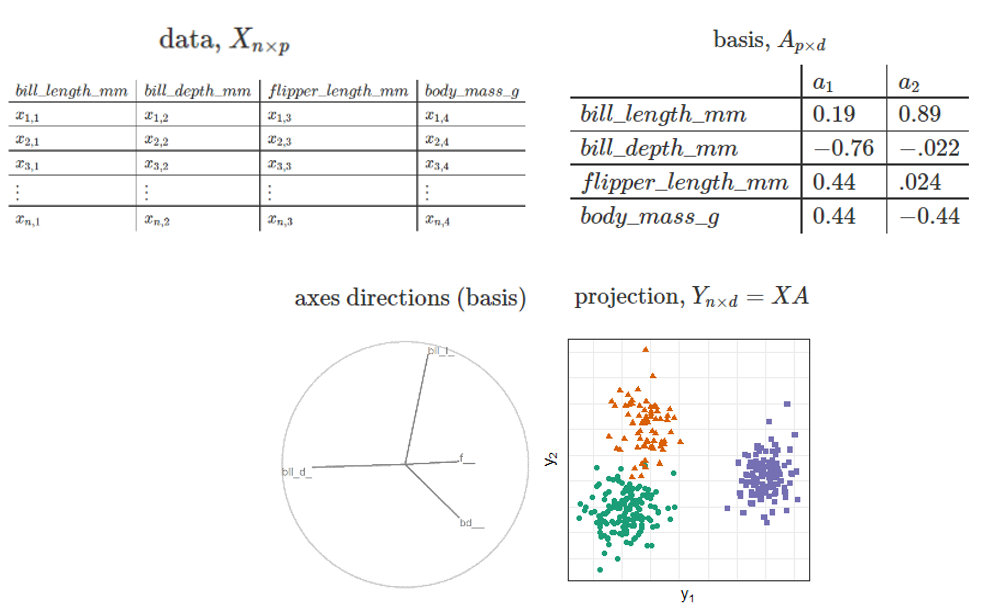

```{r, include = FALSE}
current_file <- knitr::current_input()
basename <- gsub(".Rmd$", "", current_file)

knitr::opts_chunk$set(
  fig.path = sprintf("images/%s/", basename),
  fig.width = 6,
  fig.height = 4,
  fig.align = "center",
  out.width = "100%",
  fig.retina = 3,
  echo = TRUE,
  warning = FALSE,
  message = FALSE,
  cache = TRUE,
  cache.path = "cache/"
)
```

```{r setup, include = FALSE}
knitr::opts_chunk$set(
  eval      = TRUE,   # R code
  echo      = FALSE,  # code text
  include   = TRUE,   # plots
  results   = 'asis', # text 'markup' 'asis' 'hold' 'hide'
  fig.align = "center",
  collapse  = TRUE,
  message   = F, warning = F, error = F,
  cache     = F, cache.lazy = F
)
require("knitr")
require("kableExtra")
require("magrittr")
## for cheem stuff:
require("plotly")
require("spinifex")
load("../../trees_of_cheem/apps/cheem_app/data/0local_funcs.RData")
load("../../trees_of_cheem/apps/cheem_app/data/2preprocess_simulation.RData")
shap_obs <- 18L; comp_obs <- 111L;

## prep linked plotly for later ----
THIS_linked_plotly_func <- function(
  layer_ls,
  shap_obs = NULL,
  comp_obs = NULL,
  height_px = 640L,
  width_px = 640L,
  do_include_maha_qq = FALSE
){
  .alpha <- ifelse(nrow(layer_ls$decode_df) > 999L, .1, .6)
  .xlab <- ifelse(do_include_maha_qq == FALSE, "PC1",
                  "PC1 | Quantile, chi-squared")
  .ylab <- ifelse(do_include_maha_qq == FALSE, "PC2",
                  "PC2 | Quantile, observed Mahalanobis distance")
  ## Remove QQ maha rows if needed
  plot_df <- layer_ls$plot_df ## Init
  if(do_include_maha_qq == FALSE){
    plot_df <- layer_ls$plot_df[
      layer_ls$plot_df$projection_nm != "QQ Mahalanobis distance", ]
    height_px <- height_px / 2L ## Half height display as qq maha is removed.
  }
  is_classification <- attr(layer_ls, "problem_type") == "classification"
  # ifelse("is_misclassified" %in% colnames(layer_ls$decode_df), TRUE, FALSE)
  pred_clas <- as.factor(FALSE) ## If regression; dummy pred_clas
  if(is_classification == TRUE) pred_clas <-
    layer_ls$decode_df$predicted_class %>%
    rep_len(nrow(plot_df)) %>%
    as.factor()
  
  gg <- plot_df %>%
    plotly::highlight_key(~rownum) %>%
    ggplot(aes(V1, V2))
  ## Red misclassified points, if present
  if(is_classification == TRUE){
    .rn_misclass <- which(layer_ls$decode_df$is_misclassified == TRUE)
    .idx_misclas <- plot_df$rownum %in% .rn_misclass
    if(sum(.idx_misclas) > 0L){
      .df <- plot_df[.idx_misclas, ] %>% plotly::highlight_key(~rownum)
      gg <- gg +
        geom_point(aes(V1, V2), .df,
                   color = "red", fill = NA,
                   shape = 21L, size = 3L, alpha = .alpha)
    }
  }
  ## Highlight comparison obs, if passed
  if(is.null(comp_obs) == FALSE){
    .idx_comp <- plot_df$rownum == comp_obs
    if(sum(.idx_comp) > 0L){
      .df <- plot_df[.idx_comp, ] %>% plotly::highlight_key(~rownum)
      gg <- gg +
        ## Highlight comparison obs
        geom_point(aes(V1, V2, color = pred_clas[.idx_comp]),
                   .df, size = 4L, shape = 4L)
    }
  }
  ## Highlight shap obs, if passed
  if(is.null(shap_obs) == FALSE){
    .idx_shap <- plot_df$rownum == shap_obs
    if(sum(.idx_shap) > 0L){
      .df <- plot_df[.idx_shap, ] %>% plotly::highlight_key(~rownum)
      gg <- gg +
        geom_point(aes(V1, V2, color = pred_clas[.idx_shap]),
                   .df, size = 5L, shape = 8L)
    }
  }
  ## Maha skew text,
  #### geom_text not working with plotly... & annotate() not working with facets...
  if(do_include_maha_qq == TRUE){
    gg <- gg +
      geom_text(aes(x = -Inf, y = Inf, label = ggtext),
                hjust = 0L, vjust = 1L, size = 4L)
  }
  ## Normal points
  gg <- gg +
    suppressWarnings(geom_point(
      aes(V1, V2, color = pred_clas, shape = pred_clas, tooltip = tooltip),
      alpha = .alpha, show_legend = FALSE)) +
    facet_grid(rows = vars(projection_nm), cols = vars(layer_nm), scales = "free") +
    theme_bw() +
    labs(x = .xlab, y = .ylab) +
    scale_color_brewer(palette = "Dark2") +
    theme(axis.text  = element_blank(),
          axis.ticks = element_blank(),
          legend.position = "off")
  return(gg)
}
linked_plotly <- THIS_linked_plotly_func(
  shap_layer_ls, shap_obs, comp_obs,
  do_include_maha_qq = FALSE) %>%
  ggplotly(tooltip = "tooltip") %>%
  config(displayModeBar = FALSE) %>% ## Remove html buttons
  layout(dragmode = "select", showlegend = FALSE) %>% 
  event_register("plotly_selected") %>%
  highlight(on = "plotly_selected", off = "plotly_deselect")

  ## Prep rt_anim for later -----
.df <- shap_layer_ls$shap_df
bas <- .df[shap_obs, -ncol(.df)] %>%
  as.matrix(nrow = 1L) %>% t() %>%
  tourr::normalise()
mv <- 2L#spinifex::manip_var_of(bas)
.opts <- rownames(bas)
mv_nm <- .opts[mv]

ggt142 <- manual_tour1d_func(
  shap_layer_ls, bas, mv_nm,
  shap_obs, comp_obs,
  do_add_pcp_segements = TRUE,
  pcp_shape = c(142, 124), ## '|' plotly and gganimate respectively
  angle = .08)

rt_anim <- animate_plotly(ggt142) %>% layout(dragmode = FALSE, showlegend = FALSE) %>% ## Set drag left mouse
  event_register("plotly_selected") %>% ## Reflect "selected", on release of the mouse button.
  highlight(on = "plotly_selected", off = "plotly_deselect")

### half-working title slide; c+p outside of chunk ###
# background-size: cover
# class: title-slide
# count: false
# <!-- Half working custom title slide -->
# 
# # .monash-blue[`r rmarkdown::metadata$title`]
# 
# <br>
# <h2 style="font-weight:900!important;">`r rmarkdown::metadata$subtitle`</h2>
# .bottom_abs.width100[
# Presenter: *`r rmarkdown::metadata$author`*
# <i class="fas fa-university"></i> `r rmarkdown::metadata$department`, <Br>&nbsp;&nbsp;&nbsp;&nbsp;&nbsp;Monash University, Melbourne, Australia
# <i class="fas fa-envelope"></i>  `r rmarkdown::metadata$email`
# <a href="https://twitter.com/statsgen" style="color:black"><i class="fab fa-twitter"></i> @statsgen</a>
# <i class="fas fa-calendar-alt"></i> `r rmarkdown::metadata$date`
# <br>
# ]
```

background-size: cover
class: title-slide
count: false

# .monash-blue[`r rmarkdown::metadata$title`]

<br>

<h2 style="font-weight:900!important;">`r rmarkdown::metadata$subtitle`</h2>

.bottom_abs.width100[
<br>
Presenter: *`r rmarkdown::metadata$author`* <br>
`r rmarkdown::metadata$department` <br>
<!-- `r rmarkdown::metadata$email` <br>-->
`r rmarkdown::metadata$date` <br>
<br>
Slides -- [github.com/nspyrison/phd_milestones/_slides](https://github.com/nspyrison/phd_milestones/_slides)
]

---

## Outline

.pull-left[
<br><br><br>
- Introduction
- Motivation
- Research objectives & methodology
- Refresher: linear projections

**RO#2 Radial tour user study:**
- Experimental factors
- Particpant task
- Mixed regression model
- Results
]

.pull-right[
**RO#3, Radial tour and local explanations:**
- Local explanations
- SHAP values

**Our application:**
- Global view
- Radial tour
- Tour end points
- Demo application
- Conclusion
- Thesis progress
- Thesis timeline
- Acknowledgements
]


---

## Introduction

- Multivariate data visualization
- Data visualization *tour*; animation of continuous linear projections over small changes in the projection basis
- *radial tour* (RO#1); given a basis and variable rotate the contribution fully into and out of the projection frame
- Efficacy of the radial tour (RO#2); user study measuring against PCA and grand tour (randomly select target bases)
- In exploratory artificial intelligence, _local explanations_ explore variable importance at one observation
    - Further investigate with the radial tour (RO#3)

---

## Motivation

- *Exploratory data analysis* is important for understanding the data and testing the validity of assumptions
- Data visualization is more robust and thorough than statistical summarization alone
- Tours are one way to extend our ability to visualize data space as dimensions increase
- Growing tension between the accuracy and interpretability of models.

---

## Linear projections & orthonormal basis

```{r, echo = F, out.width = '75%'}

```

---

## Research objectives & methology

__Can the radial tour help analysts understand linear projections and explore the sensitivity of structure in the projection to the variables contributing to the projection?__
<br>

- 1) Define user interaction for the radial tour to add and remove variables from a 2D linear projection
    - *Algorithm design*, develop and apply user interaction; R package `{spinifex}` _Spyrison, et al, 2019_
- 2) Do analysts better understand the relationship between variables and structure in a 2D linear projection better when the interactive manual tour is available?
    - *Experimental study*, $n=108$ within participant user study comparing radial tours with PCA, and the grand tour.
- 3) Can the radial toru be used in conjunction with the local explanation, SHAP, to improve the interpretability of black-box models?
    - *fundamental visualization design*, how can we use the radial tour to explore the structure identified in local explanations of a black-box model

---
class: transition

## RO#2, User study

---

.pull-left[
## Experimental factors

- _factor_; visualization method
- _location_ of separation; mix a signal and noisy dimension at different ratios
- _shape_ & orientations of the clusters
- _dimension_-ality and number of clusters
]

.pull-right[
```{r echo = F, out.width = '75%'}

```
]

---

## Task

- Select any/all variables that contribute more than $1/p$ of the separation between the orange triangle and the green circles

```{r echo = F, out.width = '80%'}

```

---

## Mixed regression model

\begin{array}{ll}
&\widehat{Y} = \mu + \alpha_i * \beta_j + \gamma_k + \delta_l + \textbf{Z} + \textbf{W} + \epsilon \newline
\text{where } &\mu \text{ is the intercept of the model including the means of random effects} \newline
&\textbf{Z} \sim \mathcal{N}(0,~\tau), \text{ the random effect of participant} \newline
&\textbf{W} \sim \mathcal{N}(0,~\upsilon), \text{ the random effect of simulation} \newline
&\epsilon   \sim \mathcal{N}(0,~\sigma), \text{ the error of the model} \newline
&\alpha_i \text{, fixed term for factor}~|~i\in (\text{pca, grand, radial}) \newline
&\beta_j  \text{, fixed term for location}~|~j\in (\text{0/1, 33/66, 50/50}) \text{ % noise/signal mixing} \newline
&\gamma_k \text{, fixed term for shape}~|~k\in (\text{EEE, EEV, EVV banana}) \text{ model shapes} \newline
&\delta_l \text{, fixed term for dimension}~|~l\in (\text{4 variables & 3 cluster, 6 var & 4 cl})
\end{array}

---

## Results

```{r echo = F, out.width = '90%'}
knitr::include_graphics(
  "./slide_figures/spinifex_study_y1_results.PNG")
```

---
class: transition

## RO#3, Radial tour and local explanations

---

## Local explanations

- Point-measurement, the variable weights of the importance to the model
- Applied to 1 observation, given a model

```{r echo = F, out.width = '60%'}
knitr::include_graphics(
  "./slide_figures/lime_nonlinear.png")
```
*Ribeiro, M. et. al. (2017). Why Should I Trust You?*

---

.pull-left[
## SHAP values

- SHAP is a model-agnostic local explanation, we apply to random forest models
- Approximate variable importance at one point-observation of the model; median importance, permuting over combinations of the explanatory variables
]

.pull-right[
```{r echo = F, out.width = '100%'}
knitr::include_graphics(
  "./slide_figures/cheem_fifa_messi_dijk.png")
```
]

---
class: transition

## Our application, Trees of Cheem

---

## Global View

```{r echo = F, out.width = '100%', out.height='600px'}
linked_plotly
```

???

- PC1:2 of data (left) and SHAP (right)
- points color and shape are mapped to *predicted* cluster,
- misclassified have red circle.

---

.pull-left[
## Radial tour

- SHAP value of the selected observation, `'dashed line`, (previously '*') becomes the 1D projection basis, grey/black bars
- Other shap values displayed as faint parallel coordinate lines, comparison observation dotted line (previously 'x')
<br><br>

- Compare initial, full contribution, no contribution
]

.pull-right[
```{r echo = F, out.width='100%', out.height='600px'}
rt_anim
```
]

---

## Conculsion

- local explanation, give observation level variable importance
- Start with a global approximation for exploration and observation selection
- View as a radial tour exploring the structure identified by the SHAP values
    - Default to the variable that has largest deviation from expected value

---

## Thesis progress

.larger[.larger[
- Introduction -- 60%
- Literature review -- 80%
- (RO #1) GI & radial tours -- 90%
- (RO #2) radial tour efficacy user study -- 80%
- (RO #3) radial tour & local explanations -- 70%
- Discussion -- 50%
]]

---

## Thesis timeline

```{r, echo = F, out.width = '85%'}
knitr::include_graphics("./slide_figures/timeline_post_presubmission.png")
```

---

## Acknowledgments

<br><br>
Special thanks to Professor Przemyslaw Biecek for his time and input suggesting SHAP and FIFA in addition to the `{DALEX}` package eco-system and *Exploratory Model Analysis* book.

<br>
Thanks to Di and Kim for their guidance and the panel and chair for their time and input.

<br>
This research was supported by an Australian government Research Training Program (RTP) scholarship. These slides were in `R` using `{rmarkdown}` and `{xaringan}` *(R Core Team, 2021; Xie et al. 2018; Xie, 2018)*


---
background-size: cover
class: title-slide
count: false

### Thank you for attending, any questions?

<hr><br>

<h1 class="monash-blue" style="font-size: 24pt!important;">`r rmarkdown::metadata$title`</h1>

<br>

<h3 style="font-weight:900!important;">`r rmarkdown::metadata$subtitle`</h2>

.bottom_abs.width100[
<br>
Presenter: *`r rmarkdown::metadata$author`* <br>
`r rmarkdown::metadata$department` <br>
<!-- `r rmarkdown::metadata$email` <br>-->
`r rmarkdown::metadata$date` <br>
<br>
Slides -- [github.com/nspyrison/phd_milestones/_slides](https://github.com/nspyrison/phd_milestones/_slides)
]
