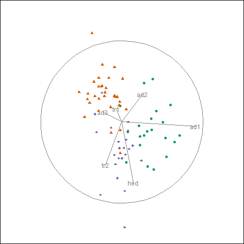
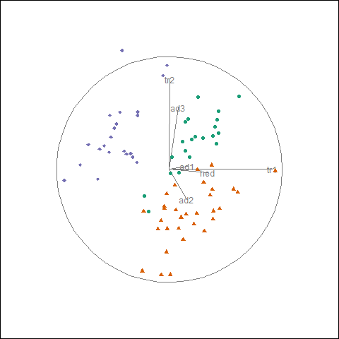
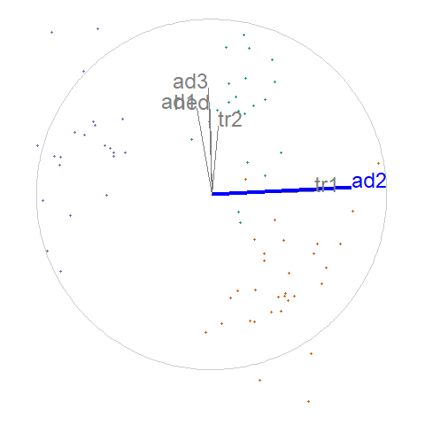

```{r setup_pres, include = FALSE}
knitr::opts_chunk$set(
  eval      = TRUE,  # R code 
  echo      = FALSE, # code text
  include   = TRUE,  # plots
  results   = 'asis', # text 'markup' 'asis' 'hold' 'hide'
  message   = F, warning = F, error = F, cache = F, cache.lazy = F,
  fig.align = "center",
  collapse  = TRUE
)

library(magrittr)
library(knitr)
library(kableExtra)
```

## Motivation

Exploratory data analysis is important and ubiquitous, and it is important to keep visual interpretation: 


Datasaurus dozen; same means, standard deviations, and correlations, *(Matejka & Fitzmaurice, 2017)*

---

## Context: data analysis workflow

```{r, echo = F, out.width = '80%', out.height = '80%'}
knitr::include_graphics("./slide_figures/data_analysis_workflow.png")
```
*Wickham & Grolemund, 2016*

- Visualization is a key aspect of data analysis workflow loop
- Reproducible from programmatic scripts (& reduced human error)
- Transparent research hosted publicly on [github](https://github.com/nspyrison).

---

## Visualizing multivariate spaces

- Visualization  multivariate space is complex; dimension reduction
- Static projections do not portray all of the variation in the data
- Dynamic rotations do convey more variation and more accurate structure

**Shadow puppet analogy (linear projection from 3- to 2D):**


---

## Dynamic linear projections, tours   

**Available on CRAN,** `tourr` R package, *(Wickham et al. 2011)*

- Random choice - *grand tour* random forest walk in $p$-space *(Asimov 1985)*
- Data-driven - *guided tour* projection pursuit, optimize an objective function on the projection *(Hurley & Buja 1990)*
- Many other geometric displays, this talk uses scatterplots

--

.pull-left[
.center[grand tour (random):]
```{r, echo = F, out.height = '70%', out.width = '70%'}

```
]

--

.pull-right[
.center[guided tour - optimizing holes index:]
```{r, echo = F, out.height = '70%', out.width = '70%'}

```
]

---

## Visualization dimension: 3D and immersive 3D 

Data visualization has lagged behind in adopting 3D and immersive technologies, despite promising finds

.pull-left[
```{r, out.width = '90%', out.height = '90%'}
knitr::include_graphics("./slide_figures/nelson98fig.PNG")
```

*(Nelson et al. 1998)*
- tours: head-tracked VR vs standard monitor
- better cluster and shape identification, slower brushing
]

.pull-right[
3D visuals generally convey more information with more speed, but  manipulation is slower when compared with orthogonal 2D, though 3D with 2D gives the best perception *[Lee 1986, Wickens 1994, Tory 2006]*

Embedded multivariate data in immersive 3D report improved accuracy and faster response time, but a slower manipulation speed and less comfort *[Gracia 2016, Wagner 2018, Nelson 1998]*

Modern VR equipment has improved quality, attracted wider audiences, and reduced the costs of VR, it is timely to research dynamic projections in VR
]

---

## Research objectives
<hr><br>

### 1) How can user-controlled steering (UCS) be generalized to work within graphic-specific environments for 2D projections?
### 2) Does 2D UCS tours provide benefits over alternatives?
### 3) How do we extend UCS to 3D?
### 4) Does UCS in 3D displays provide benefits over 2D displays?


---

## RO 2) What benefits does UCS provide over alternatives?

**Future work, method: performance comparison assessed across benchmark datasets**

- Principal Component Analysis (PCA) 
    - A linear transformation that produces linear combinations of the variables in descending order of variation explained
- Multi-Dimensional Scaling (MDS)
    - Non-linear dimension reduction that compares the pairwise distance between observations
- T-distributed Stochastic Neighbor Embedding (tSNE)
    - Non-linear transformation preserves local proximity and reduces relative entropy
- User-controlled steering (USC), manual tour
    - Dynamic linear projections controlling the contribution of a selected variable

Measures: variation, variable transparency, clustering, structure

Design space: data sets, techniques, and measures of comparison

---

## RO 3) How do we extend UCS to 3D?

**Future work, method: algorithm design**

Extend the UCS algorithm to 3D projections and integrate with Immersive Analytics Tool Kit, `IATK`, *(Cordeil 2019)* for a common user interface across display devices.

- Extend manipulation spaces to 4D, for variable manipulation on 3D scatterplots 
- multi-dimensional function surfaces

.pull-left[
```{r, out.width = '70%', out.height = '70%'}

```
]

.pull-right[
```{r, out.width = '80%', out.height = '80%'}
knitr::include_graphics("./slide_figures/RO3MockUp2.PNG")
```
]

---

## RO 3) How do we extend UCS to 3D? (& function surfaces)

**Future work, method: algorithm design**

- multi-dimensional function surfaces

.pull-left[
```{r, out.width = '70%', out.height = '70%'}

```
]

.pull-right[
```{r, out.width = '80%', out.height = '80%'}
knitr::include_graphics("./slide_figures/rgl_surface.PNG")
```
]

---

## RO 4) Does UCS in 3D displays provide benefits over 2D displays?

**Future work, method: usability study**

.pull-left[
lineup design *(Hofmann et al. 2012)*
- Visual variant of statistical p-test
- Pick the real data against data generated from the null hypothesis
- Quantitative comparison across display type

]

.pull-right[
Design space:
- Display type: 2D monitor, 3D monitor, head-mount, physical immersion
- Task type: structure, UCS, clustering, dimensionality
- Measures: accuracy, speed, confidence, preference, demographic information, VR and data visualization experience
]

---

## Contributions
<hr><br>

### 1) A modified UCS algorithm and new implementation applied to contemporary high energy physics and astrophysics applications in 2D animation frameworks.
### 2) A performance comparison of static and interactive UCS projection techniques assessed on benchmark data sets from the recent literature.
### 3) A new algorithm for UCS in 3D. With new applications to multi-dimensional function visualization in 3D.
### 4) Quantitative understanding of the relative benefits of UCS across 2- and 3D display devices.

---

### Research timeline

```{r timeline, echo = F, fig.height = 8, fig.width = 14}
knitr::include_graphics("../figures/phd_timeline.PNG")
```

---
class: center, middle

## Acknowledgments

Slides created in R using rmarkdown and xaringan

Slides available -- [github.com/nspyrison/mid_candidature/_slides]( https://github.com/nspyrison/mid_candidature/_slides)

.large[Questions?]
<br><br><br><br>

.left[
*R Core Team, 2018*

*Xie et al. 2018*

*Xie, 2018*
]

---

## References (1/3)

*In order of appearance:*

Matejka, J., & Fitzmaurice, G. (2017). Same Stats, Different Graphs: Generating Datasets with Varied Appearance and Identical Statistics through Simulated Annealing. In Proceedings of the 2017 CHI Conference on Human Factors in Computing Systems  - CHI ’17 (pp. 1290–1294). Denver, Colorado, USA: ACM Press. https://doi.org/10.1145/3025453.3025912

Wickham, H., & Grolemund, G. (2016). R for Data Science: Import, Tidy, Transform, Visualize, and Model Data. O’Reilly Media, Inc.

Wickham, H., Cook, D., Hofmann, H., & Buja, A. (2011). tourr : An R Package for Exploring Multivariate Data with Projections. Journal of Statistical Software, 40(2). https://doi.org/10.18637/jss.v040.i02

Asimov, D. (1985). The Grand Tour: a Tool for Viewing Multidimensional Data. SIAM Journal on Scientific and Statistical Computing, 6(1), 128–143.

Hurley, C., & Buja, A. (1990). Analyzing High-Dimensional Data with Motion Graphics. SIAM Journal on Scientific and Statistical Computing, 11(6), 1193–1211. https://doi.org/10.1137/0911068

Nelson, L., Cook, D., & Cruz-Neira, C. (1998). XGobi vs the C2: Results of an Experiment Comparing Data Visualization in a 3-D Immersive Virtual Reality Environment with a 2-D Workstation Display. Computational Statistics, 14(1), 39–52.

---

## References (2/3)

Lee, J. M., MacLachlan, J., & Wallace, W. A. (1986). The Effects of 3D Imagery on Managerial Data Interpretation. MIS Quarterly, 257–269.

Wickens, C. D., Merwin, D. H., & Lin, E. L. (1994). Implications of Graphics Enhancements for the Visualization of Scientific Data: Dimensional Integrality, Stereopsis, Motion, and Mesh. Human Factors, 36(1), 44–61.

Tory, M., Kirkpatrick, A. E., Atkins, M. S., & Moller, T. (2006). Visualization Task Performance with 2D, 3D, and Combination Displays. IEEE Transactions on Visualization and Computer Graphics, 12(1), 2–13.

Gracia, A., González, S., Robles, V., Menasalvas, E., & von Landesberger, T. (2016). New Insights into the Suitability of the Third Dimension for Visualizing Multivariate/Multidimensional Data: A Study Based on Loss of Quality Quantification. Information Visualization, 15(1), 3–30. https://doi.org/10.1177/1473871614556393

Wagner Filho, J., Rey, M., Freitas, C., & Nedel, L. (2018). Immersive Visualization of Abstract Information: An Evaluation on Dimensionally-Reduced Data Scatterplots.

Cook, D., & Buja, A. (1997). Manual Controls for High-Dimensional Data Projections. Journal of Computational and Graphical Statistics, 6(4), 464–480. https://doi.org/10.2307/1390747

---

## References (3/3)

Wang, B.-T., Hobbs, T. J., Doyle, S., Gao, J., Hou, T.-J., Nadolsky, P. M., & Olness, F. I. (2018). Visualizing the sensitivity of hadronic experiments to nucleon structure. ArXiv Preprint ArXiv:1803.02777.

Cook, D., Laa, U., & Valencia, G. (2018). Dynamical projections for the visualization of PDFSense data. Eur. Phys. J. C, 78(9), 742.

Cordeil, M. (2019). Immersive Analytics Toolkit (Version IATK 1.0 (Mala) Unity 2017). Retrieved from https://github.com/MaximeCordeil/IATK (Original work published 2017)

Hofmann, H., Follett, L., Majumder, M., & Cook, D. (2012). Graphical tests for power comparison of competing designs. IEEE Transactions on Visualization and Computer Graphics, 18(12), 2441–2448.

R Core Team. (2018). R: A Language and Environment for Statistical Computing. Vienna, Austria: R Foundation for Statistical Computing. Retrieved from https://www.R-project.org/

Xie, Y., Allaire, J. J., & Grolemund, G. (2018). R Markdown: The Definitive Guide. Boca Raton, Florida: Chapman and Hall/CRC. Retrieved from https://bookdown.org/yihui/rmarkdown

Xie, Y. (2018). xaringan: Presentation Ninja. Retrieved from https://CRAN.R-project.org/package=xaringan